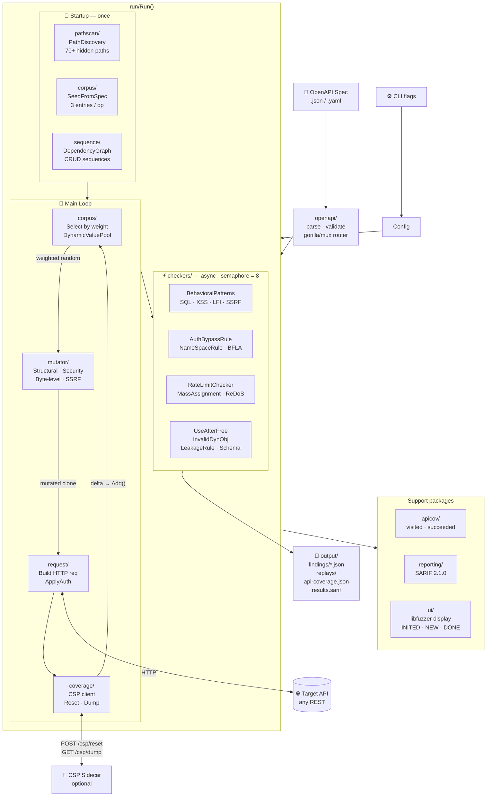
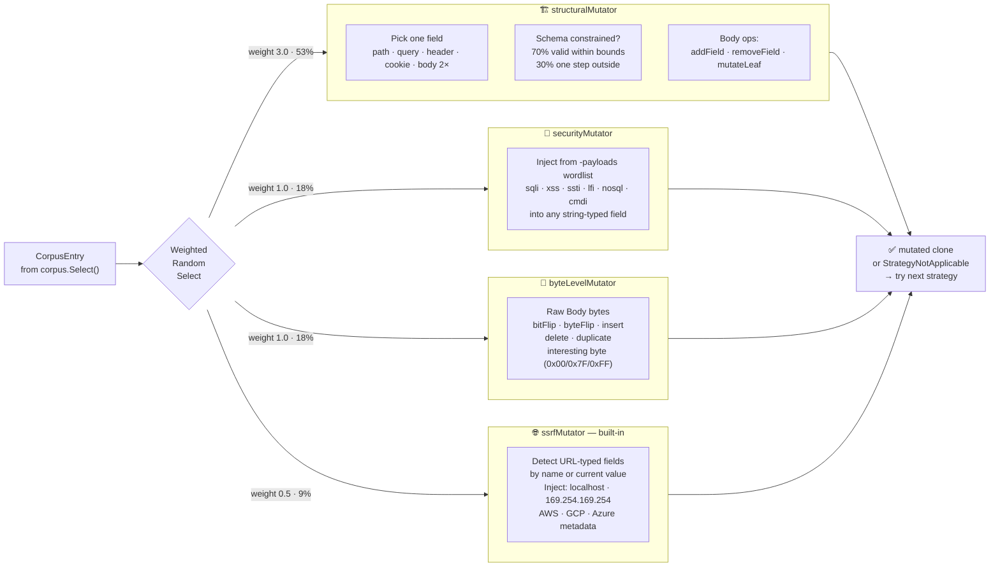
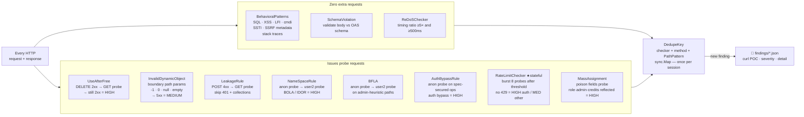
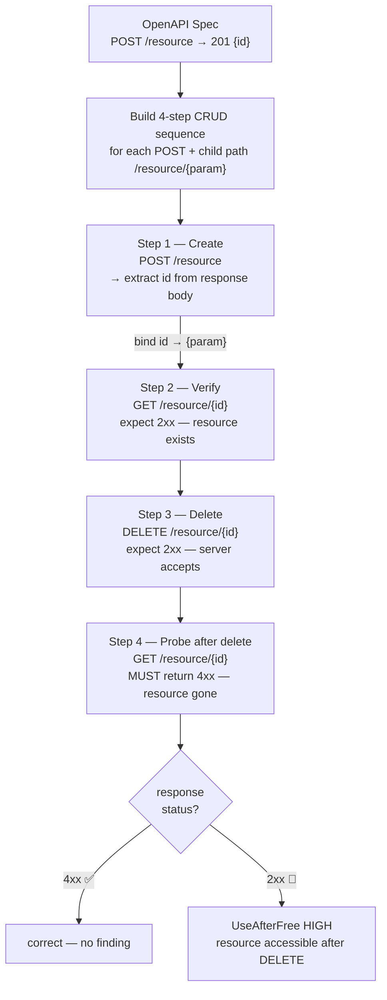
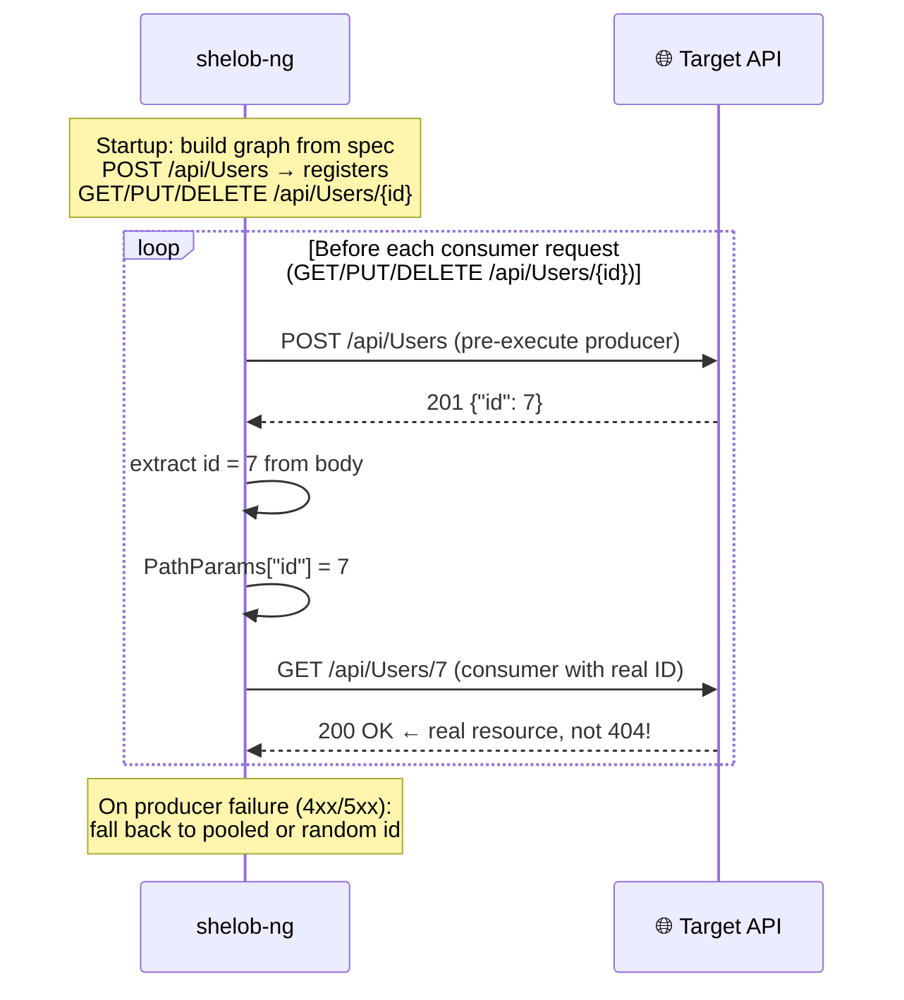

# shelob-ng

Coverage-guided REST API security fuzzer. Reads an OpenAPI 3.x spec, generates
and mutates HTTP requests, and runs a suite of security checkers on every
response — all without modifying or recompiling the target application.

```
INFO: spec: juice-shop.openapi.json       target: http://localhost:3000
INFO: corpus: 171 seed entries            checkers: BehavioralPatterns UseAfterFree InvalidDynamicObject LeakageRule NameSpaceRule SchemaViolation

#0       INITED   cov:     0  corpus:   171  ops:   0/95   req/s:     0  2xx:     0  4xx:     0  5xx:     0
#8       NEW      cov:    52  corpus:   179  ops:   8/95   req/s:    24  2xx:     2  4xx:     5  5xx:     1  [POST /api/SecurityAnswers  +18]
#64      FINDING  cov:   831  corpus:   214  ops:  52/95   req/s:    27  2xx:    22  4xx:    29  5xx:    13  [BehavioralPatterns/high] SQL Error Leakage  http://localhost:3000/rest/products/search?q=%00
#128     NEW      cov:  1204  corpus:   231  ops:  71/95   req/s:    28  2xx:    51  4xx:    59  5xx:    18  [GET /rest/products/search  +6]
```

---

## Table of contents

1. [Features](#features)
2. [Architecture](#architecture)
3. [Quick start](#quick-start)
4. [Usage scenarios](#usage-scenarios)
5. [Corpus and selection](#corpus-and-selection)
6. [Mutation strategies](#mutation-strategies)
7. [Security checkers](#security-checkers)
8. [Stateful sequence testing](#stateful-sequence-testing)
9. [Producer-consumer dependency graph](#producer-consumer-dependency-graph)
10. [Status display](#status-display)
11. [Output format](#output-format) (findings JSON, SARIF, api-coverage)
    - [SARIF report](#sarif-report--sarif-path)
12. [All flags](#all-flags)
13. [Coverage Sidecar Protocol (CSP)](#coverage-sidecar-protocol)
14. [Example: OWASP Juice Shop](#example-owasp-juice-shop)

---

## Features

| Feature | Description |
|---------|-------------|
| **OpenAPI-guided** | Seeds corpus from spec; all 3.x parameter locations supported (path, query, header, cookie, body) |
| **AFL-style corpus** | Inputs that increase code coverage are saved, weighted by delta, and preferentially mutated |
| **Four mutators** | Structural (grammar-constrained), byte-level, security payloads (external wordlists), SSRF (built-in, injects internal URLs into URL-typed fields) |
| **Grammar-constrained mutation** | Structural mutator reads `minimum`, `maximum`, `minLength`, `maxLength`, `enum` from the spec — 70% of mutations stay within valid bounds to reach business logic; 30% test boundary violations |
| **allOf / oneOf / anyOf** | Schema composition keywords are fully resolved before generation — polymorphic endpoints no longer generate empty bodies |
| **Circular $ref safe** | Recursive schemas (Kubernetes-style tree nodes) are handled with a depth cap of 5; no stack overflow |
| **Producer-consumer graph** | Links `POST /X` (producer) to `GET|PUT|DELETE /X/{id}` (consumer); pre-executes the producer to inject a real resource ID before the consumer request; learns at runtime when the spec lacks response schemas |
| **Eleven checkers** | BehavioralPatterns, UseAfterFree, InvalidDynamicObject, LeakageRule, NameSpaceRule, BFLA, AuthBypassRule, SchemaViolation, RateLimitChecker, MassAssignment, ReDoSChecker |
| **Path Discovery pre-scan** | Probes 70+ hidden/undocumented paths (debug endpoints, Spring Actuator, version-divergent routes, admin interfaces) before the main loop; `-path-wordlist` extends the built-in list |
| **Rate limit detection** | RateLimitChecker fires a burst of 8 rapid requests after a threshold of natural non-429 responses; HIGH on auth paths (login, OTP, password reset), MEDIUM elsewhere |
| **Mass assignment detection** | MassAssignment checker injects privilege-escalation fields (`role:admin`, `admin:true`, `credits:99999`) into POST/PUT/PATCH bodies; HIGH when reflected in response, MEDIUM when silently accepted |
| **ReDoS detection** | ReDoSChecker compares response time for short vs. long inputs designed for catastrophic backtracking (email/URL/IP patterns); fires when ratio ≥ 5× and absolute delay ≥ 500 ms |
| **SSRF payload injection** | Built-in ssrfMutator detects URL-typed fields by name (`*_url`, `*_api`, `*_callback`, `mechanic_api`, etc.) and injects AWS/GCP/Azure metadata URLs and localhost variants |
| **BOLA / IDOR detection** | NameSpaceRule replays every 2xx request with a second-user session; cross-account access = finding |
| **BFLA detection** | BrokenFunctionLevelAuthorization probes admin/privileged endpoints with a lower-privilege user; role-boundary bypass = finding |
| **Auth bypass detection** | AuthBypassRule fires when an anonymous probe returns 2xx on an operation the OpenAPI spec marks as requiring authentication |
| **SARIF 2.1.0 output** | `-sarif <path>` writes a Svacer-compatible SARIF report at run end; importable into GitHub Security, AzureDevOps, Svacer |
| **Stateful CRUD sequences** | Auto-derived from spec: create → read → delete → probe; detects server-side UseAfterFree |
| **CSP coverage feedback** | Language-agnostic HTTP sidecar protocol; adapters for Node.js, Go, Python, C |
| **Deduplication** | Each unique (checker, method, endpoint) generates exactly one finding file; stable across runs |
| **POC generation** | Every finding contains a `curl` command that reproduces the issue |
| **API coverage report** | Tracks reached (any response) and succeeded (2xx) per OpenAPI operation |
| **Corpus persistence** | Save/load corpus to disk; resume long runs or share interesting inputs |
| **Dynamic value pool** | Harvests real IDs and tokens from responses; reuses them as path parameters |
| **Clean shutdown** | `Ctrl+C` (SIGINT/SIGTERM) finishes the current iteration then saves `api-coverage.json` and corpus before exiting |
| **RPS limiter** | Optional requests-per-second cap for rate-limited or production-adjacent targets |
| **libfuzzer-style UI** | Event-driven terminal output: INITED / NEW / pulse / FINDING / DONE |

---

## Architecture



### Package map

```
shelob-ng/
├── main.go                   entry point
├── cliArgs/                  CLI flag parsing → Config struct
├── openapi/                  spec loading, gorilla/mux router, seed input
├── run/                      main fuzzing loop (Run function)
├── corpus/
│   ├── entry.go              CorpusEntry: fields, Hash(), Clone(), Weight()
│   ├── corpus.go             weightedCorpus: Add/Select/evict (max 15 000)
│   ├── selection.go          prefix-sum weighted random select O(log n)
│   ├── pool.go               DynamicValuePool: ring buffer, 70/30 real/random
│   ├── seed.go               SeedFromSpec: 3 entries per operation
│   ├── dependency.go         DependencyGraph: maps consumers → ProducerBinding; RegisterIfAbsent
│   └── storage.go            Save/Load JSON corpus to disk
├── mutator/
│   ├── mutator.go            Mutator interface, weighted orchestration
│   ├── schema_index.go       SchemaIndex: O(1) FieldConstraint lookup by (method, path, location, name)
│   ├── structural.go         grammar-constrained + type-aware edge case mutations
│   ├── bytelevel.go          6 byte-level ops on raw body
│   ├── security.go           inject payload strings into string fields
│   ├── fieldpicker.go        pick field by location (body 2× weight)
│   ├── jsonmutate.go         dotted-path JSON leaf access/mutation
│   └── payloads/             external wordlist loader
├── coverage/
│   ├── coverage.go           Client interface, Config, Snapshot
│   ├── csp.go                cspClient: Reset/Dump HTTP calls
│   └── noop.go               noopClient: used when CSP disabled
├── checkers/
│   ├── checker.go            Finding struct (+ PathPattern, POC, DedupeKey); CheckContext (+ APIKey, Token)
│   ├── poc.go                BuildCurlPOC: generate curl reproduction command; ApplyAuth: set auth headers on probe requests
│   ├── behavioral.go         regex patterns: SQL/XSS/LFI/SSTI/stacktrace
│   ├── invaliddyn.go         boundary path params → 5xx detection
│   ├── useafterfree.go       DELETE 2xx → GET 2xx detection
│   ├── leakage.go            POST 4xx → GET 2xx detection
│   ├── namespace.go          BOLA/IDOR: user2 replay
│   ├── bfla.go               BFLA: role-boundary user2 probe on privileged endpoints
│   ├── authbypass.go         AuthBypassRule: anon probe vs spec security declarations
│   └── schema.go             OpenAPI response validation (real body)
├── sequence/
│   ├── builder.go            derive CRUD sequences + dependency graph; LearnProducer (runtime)
│   ├── sequence.go           Runner.Run: stateful multi-step execution; ExtractJSONField
│   └── replay.go             SaveReplay: persist steps + findings to JSON
├── request/
│   └── from_entry.go         build *http.Request from CorpusEntry; ApplyAuth: set Bearer/API-key headers
├── apicov/
│   └── apicov.go             per-operation reached/succeeded counters
├── reporting/
│   └── sarif.go              WriteSARIF: Svacer-compatible SARIF 2.1.0; ReadFindingsDir
├── auth/                     cookie login + token extraction from body
├── ui/                       libfuzzer-style terminal Logger
├── adapters/
│   ├── nodejs/               V8 Inspector CSP adapter
│   ├── go/                   runtime/coverage CSP adapter
│   ├── python/               coverage.py CSP adapter
│   └── c/                    gcov CSP adapter
└── example/                  Juice Shop walkthrough (10 scenarios, Makefile)
```

---

## Quick start

**Requirements:** Go ≥ 1.22, an OpenAPI 3.x spec file, a running REST API.

```bash
# Build
git clone <repo> shelob-ng
cd shelob-ng
go build -o shelob-ng .

# 1. Minimal — no auth, no CSP, pure random
./shelob-ng -spec openapi.json -url http://localhost:3000

# 2. With authentication (auto-detects login endpoint from spec)
./shelob-ng -spec openapi.json -url http://localhost:3000 \
    -user admin@example.com -password secret

# 3. With security payload injection
./shelob-ng -spec openapi.json -url http://localhost:3000 \
    -user admin@example.com -password secret \
    -payloads sqli=/tmp/sqli.txt,xss=/tmp/xss.txt \
    -duration 1h -output ./results

# 4. With BOLA detection (two users)
./shelob-ng -spec openapi.json -url http://localhost:3000 \
    -user user1@example.com -password pass1 \
    -user2 user2@example.com -pass2 pass2

# 5. API key authentication (sets X-Api-Key header on every request)
./shelob-ng -spec openapi.json -url http://localhost:3000 \
    -apikey your-api-key-here

# 6. Bearer token authentication (sets Authorization: Bearer … header)
./shelob-ng -spec openapi.json -url http://localhost:3000 \
    -token eyJhbGciOiJSUzI1NiJ9...

# 7. Coverage-guided (requires CSP sidecar on the target)
./shelob-ng -spec openapi.json -url http://localhost:3000 \
    -csp-url http://localhost:8080 \
    -corpus-dir ./corpus -duration 4h

# 8. Full — everything enabled
./shelob-ng -spec openapi.json -url http://localhost:3000 \
    -user user1@example.com -password pass1 \
    -user2 user2@example.com -pass2 pass2 \
    -payloads sqli=/tmp/sqli.txt,xss=/tmp/xss.txt \
    -csp-url http://localhost:8080 \
    -corpus-dir ./corpus -duration 1h -output ./results
```

---

## Usage scenarios

### Scenario A — Smoke test (pure random, no auth)

Use when you have a spec and a running target but no credentials. Finds
schema violations, stack traces, and server crashes without authentication.

```bash
./shelob-ng -spec openapi.json -url http://target:8080 -duration 30m
```

What to expect:
- `SchemaViolation` findings for endpoints that return undeclared status codes
- `BehavioralPatterns` findings when stack traces leak in 500 responses
- `InvalidDynamicObject` findings when boundary path-param values crash the server

---

### Scenario B — Authenticated fuzzing

Authenticates via `POST /login` (auto-detected from spec by path pattern or
`operationId`). All subsequent requests carry the session cookie. Use this
when the interesting endpoints require a logged-in user.

```bash
./shelob-ng -spec openapi.json -url http://target:8080 \
    -user admin@corp.local -password 'P@ssw0rd!' \
    -duration 1h -output ./results
```

How authentication works:
1. `auth` package scans the spec for a `POST` operation matching `/login`,
   `/users/login`, `operationId` containing `login` or `authenticate`, etc.
2. Sends `POST` with `{"email": user, "password": password}` (or `username`/`user`)
3. Extracts session cookies from `Set-Cookie` headers; if absent, reads the
   response body for `token`, `access_token`, `authentication.token` fields
4. Attaches cookies to every subsequent fuzzer request

---

### Scenario C — BOLA / BFLA detection

`NameSpaceRule`, `BFLA`, and `AuthBypassRule` all issue authentication probes
but test fundamentally different properties:

| Checker | Tests | Anonymous 2xx means… | Example |
|---------|-------|----------------------|---------|
| `NameSpaceRule` | **Ownership** — user2 accessing user1's resource | endpoint is public → skip | `GET /orders/42` (user1's order) visible to user2 |
| `BFLA` | **Role** — user2 (low privilege) calling an admin function | endpoint is public → skip | `GET /admin/users` accessible to a regular customer |
| `AuthBypassRule` | **Missing auth** — no credentials needed on a spec-secured operation | endpoint leaks data → **FIRE** | `GET /api/Users` returns user list without any token |

`AuthBypassRule` activates when at least one auth credential is configured
(`-user/-password`, `-token`, or `-apikey`). It does not need `-user2`.

Run both by providing two user accounts:

```bash
# BOLA: both users are peers, user2 should not own user1's resources
./shelob-ng -spec openapi.json -url http://target:8080 \
    -user  owner@corp.local  -password 'Pass1!' \
    -user2 other@corp.local  -pass2   'Pass2!' \
    -duration 2h -output ./results

# BFLA: user1 is admin, user2 is a lower-privilege regular user
./shelob-ng -spec openapi.json -url http://target:8080 \
    -user  admin@corp.local   -password 'AdminPass!' \
    -user2 regular@corp.local -pass2    'UserPass!' \
    -duration 2h -output ./results
```

**Probe sequence (both checkers):**
1. User1 request → 2xx
2. Anonymous probe (all auth stripped) → if 2xx, endpoint is public → skip
3. User2 probe (user2 cookies + shared `X-Api-Key` if set; Bearer token is **not**
   forwarded — it encodes user1's identity) → if 2xx → **HIGH**

**BFLA heuristic:** only fires on endpoints whose path contains a privileged segment
(`admin`, `backoffice`, `dashboard`, `internal`, `manage`, `management`, `panel`,
`private`, `staff`, `superuser`, `console`) or whose `operationId` contains `"admin"`.
This avoids duplicating NameSpaceRule findings on ordinary resource endpoints.

> **Note:** Both checkers require cookie-based login for user2 (`-user2 / -pass2`).
> Targets using only Bearer tokens for user identity are not supported.

---

### Scenario D — Security payload injection

Loads external wordlists and injects them into string fields. Combine with
`BehavioralPatterns` to detect reflected injections.

```bash
./shelob-ng -spec openapi.json -url http://target:8080 \
    -user admin@corp.local -password secret \
    -payloads sqli=sqli.txt,xss=xss.txt,ssti=ssti.txt,lfi=lfi.txt \
    -duration 2h -output ./results
```

Injection targets per request:
- String-typed path parameters
- All query, header, and cookie parameters
- All string-valued leaf nodes in a JSON request body (dotted-path traversal)

Recommended payload sources:
```bash
git clone https://github.com/swisskyrepo/PayloadsAllTheThings.git /tmp/patt
cp "/tmp/patt/SQL Injection/Intruder/SQL_Bypass.txt"   sqli.txt
cp "/tmp/patt/XSS Injection/Intruder/XSS Polyglots.txt" xss.txt
```

---

### Scenario E — Coverage-guided mode

Requires a CSP sidecar running alongside the target (see
[Coverage Sidecar Protocol](#coverage-sidecar-protocol)). Each request's
coverage delta determines whether the input enters the corpus.

```bash
# Start target with CSP sidecar, then:
./shelob-ng -spec openapi.json -url http://target:8080 \
    -csp-url http://localhost:8080 \
    -corpus-dir ./corpus \
    -duration 4h -output ./results
```

With coverage feedback, the `cov:` column in the display increments and
`NEW` events show which new code paths were discovered. Without it, `cov:`
stays at 0 and the corpus grows only from first-2xx-per-operation signals.

---

### Scenario F — Corpus persistence and resumption

Save the corpus after a run, resume later from the same inputs:

```bash
# Run 1 — build corpus
./shelob-ng -spec openapi.json -url http://target:8080 \
    -corpus-dir ./corpus -duration 1h -output ./run1

# Run 2 — load saved corpus, continue
./shelob-ng -spec openapi.json -url http://target:8080 \
    -corpus-dir ./corpus -duration 1h -output ./run2
```

Corpus on disk (`./corpus/`):
```
corpus/
  index.json           {"version":1, "entry_count":243, ...}
  entries/
    3a7f2c8b....json   {"method":"POST","path_pattern":"/api/Users",...}
    ...
```

---

### Scenario G — Selective checkers

Run a targeted subset of checkers to reduce noise or focus on a class of bugs:

```bash
# Schema-only: zero extra HTTP requests, fastest
./shelob-ng -spec api.json -url http://target -checker SchemaViolation

# Only behavioral patterns + payload injection
./shelob-ng -spec api.json -url http://target \
    -checker BehavioralPatterns \
    -payloads sqli=sqli.txt,xss=xss.txt

# Stateful resource management checks
./shelob-ng -spec api.json -url http://target \
    -checker UseAfterFree,InvalidDynamicObject

# BOLA only
./shelob-ng -spec api.json -url http://target \
    -checker NameSpaceRule \
    -user u1@x.com -password p1 \
    -user2 u2@x.com -pass2 p2
```

---

### Scenario I — API key or Bearer token authentication

Use when the target API uses a static API key or a pre-obtained Bearer token
instead of cookie-based login. Both flags apply the credential to every request,
including all checker probe requests.

```bash
# API key — sets X-Api-Key: <key> on every request
./shelob-ng -spec openapi.json -url http://api.corp.local \
    -apikey sk-prod-a3f9b2c1d8e7... \
    -duration 2h -output ./results

# Bearer token — sets Authorization: Bearer <token> on every request
./shelob-ng -spec openapi.json -url http://api.corp.local \
    -token eyJhbGciOiJSUzI1NiIsInR5cCI6IkpXVCJ9... \
    -duration 2h -output ./results

# Combined: static token + BOLA detection with a second user session
./shelob-ng -spec openapi.json -url http://api.corp.local \
    -token <admin-token> \
    -user2 regular@corp.local -pass2 pass \
    -duration 2h -output ./results
```

Notes:
- `-user`/`-password` (cookie login) and `-apikey`/`-token` can be combined —
  the fuzzer will both attempt cookie login and set the static header.
- The anonymous probe inside `NameSpaceRule` strips all auth headers and cookies
  to ensure it is genuinely unauthenticated.
- The user2 probe (`-user2 / -pass2`) carries the shared `X-Api-Key` (if set)
  but **not** the Bearer token: the token encodes user1's identity (e.g. JWT `sub`
  claim) and forwarding it would authenticate user2's probe as user1, defeating
  the BOLA check. For BOLA detection, user2 must authenticate via cookies only.

---

### Scenario H — Rate-limited target

Use `-rps N` to cap throughput. The rate limiter applies to main-loop
iterations; checker probes run concurrently and are not counted.

```bash
./shelob-ng -spec openapi.json -url https://staging.api.example.com \
    -user admin@example.com -password secret \
    -rps 10 -duration 4h -output ./results
```

---

## Corpus and selection

### CorpusEntry

Each entry represents one reproducible HTTP request:

```
Method        string            "GET", "POST", "DELETE", ...
PathPattern   string            "/api/Users/{id}"          ← OpenAPI template
PathParams    map[string]any    {"id": int64(42)}
QueryParams   map[string]string {"q": "test", "page": "1"}
HeaderParams  map[string]string
CookieParams  map[string]string
Body          []byte            raw JSON / XML / binary
ContentType   string            "application/json"
CoverageDelta uint64            new V8 blocks when this entry was added
UseCount      uint64            times selected for mutation (cooling)
Generation    uint32            0 = seed from spec; increments per mutation
```

### Selection weight

```
weight(entry) = log2(1 + delta) / log2(2 + useCount)
```

- Higher `CoverageDelta` → higher initial weight (coverage-rich inputs preferred)
- Higher `UseCount` → weight decays (prevents starvation of any entry)
- Seeds have `delta = 1`; real CSP feedback raises it proportionally

Entries with `Generation > 0` (mutated) are always preferred over seeds.
When no mutated entries exist, seeds are selected uniformly.

### Corpus admission

An entry is added to the corpus when:
1. **CSP delta > 0** — the request caused new V8 basic blocks to execute, OR
2. **First 2xx for the operation** — API-level novelty even when CSP is disabled
   (synthetic `delta = 1`, ensures all reachable endpoints enter the corpus)

Maximum corpus size: 15,000 entries. On overflow, the entry with the lowest
`Weight()` is evicted.

### DynamicValuePool

After every request, `pool.Extract(body)` walks the JSON response and stores
values in a ring buffer (256 per field key). When building the next request,
`GetValue(key)` returns a server-assigned value with 70% probability (e.g., a
real user ID) instead of a randomly generated one (30%). This gives path
parameters like `/api/Users/{id}` realistic values that are more likely to
address real resources.

---

## Mutation strategies

Four strategies are composed with weighted random selection:



If all strategies return `StrategyNotApplicable`, the entry is used
as-is (clone of the selected corpus entry).

---

## Security checkers

Eleven checkers run after every request/response pair. Checkers that issue
additional HTTP probe requests do so concurrently (goroutine pool, semaphore 8).
`RateLimitChecker` is stateful (tracks per-endpoint hit counts across calls).

Additionally, **PathDiscovery** runs once before the main loop as a pre-scan,
probing 70+ hidden/undocumented paths.

Every finding is written exactly **once** per session (deduplicated by
`checker + method + path_pattern`) and includes a **`curl` POC command**
that reproduces the issue.



> ★ `RateLimitChecker` is stateful — it persists hit counts across goroutine calls.

| Checker | Extra HTTP requests | Severity | Notes |
|---------|-------------------|---------|----|
| `BehavioralPatterns` | 0 | high / medium | also detects SSRF cloud metadata responses |
| `UseAfterFree` | 1 GET | high | |
| `InvalidDynamicObject` | up to 5 | medium | |
| `LeakageRule` | 1 GET | medium | skips 401 + collection endpoints |
| `NameSpaceRule` | 1–2 | high | requires `-user2 / -pass2` |
| `BFLA` | 1–2 | high | requires `-user2 / -pass2`; privileged paths only |
| `AuthBypassRule` | 1 | high | requires auth credentials configured |
| `SchemaViolation` | 0 | medium | |
| `RateLimitChecker` | 8 (burst) | high / medium | stateful; HIGH on auth paths |
| `MassAssignment` | 1 | high / medium | POST/PUT/PATCH with JSON body only |
| `ReDoSChecker` | 2–6 (timing) | medium | conservative: 5× ratio + 500 ms |
| `PathDiscovery` | 1 per path (pre-scan) | high / medium / info | runs once before main loop |

---

## Stateful sequence testing

Every 20 fuzzing iterations shelob-ng runs one CRUD sequence (round-robin
through all built sequences).

### How sequences are derived from the spec



### Replay persistence

When a sequence produces findings, a replay file is written to
`<output>/replays/`. The replay records every step with URL, status code,
and extracted values, enabling manual reproduction:

```json
{
  "sequence": "CRUD:/api/Users",
  "executed_at": "2026-05-28T06:00:00Z",
  "steps": [
    {"method":"POST",   "url":"http://…/api/Users",   "status_code":201, "extracted":{"id":"7"}},
    {"method":"GET",    "url":"http://…/api/Users/7",  "status_code":200},
    {"method":"DELETE", "url":"http://…/api/Users/7",  "status_code":200},
    {"method":"GET",    "url":"http://…/api/Users/7",  "status_code":200}
  ],
  "findings": [{"title":"Resource accessible after DELETE", ...}]
}
```

---

## Producer-consumer dependency graph

When the fuzzer selects `GET /api/Users/{id}`, a random or pooled user ID may
not correspond to any existing resource, producing a 404. The
producer-consumer graph solves this by pre-executing the creator before each
consumer request.

### How it works



### Why 70%+ of consumer requests succeed with a real spec

On APIs that declare response schemas on POST operations, the graph is built
at startup from the spec alone. On APIs with sparse specs (such as the Juice
Shop example), the graph fills in at runtime as POSTs succeed. Either way,
consumer requests carry real IDs within seconds of the first successful POST
instead of wasting iterations on guaranteed 404s.

---

## Status display

shelob-ng prints libfuzzer-style event lines to stdout:

```
INFO: spec: openapi.json
INFO: target: http://localhost:3000
INFO: coverage: http://localhost:8080 (CSP)
INFO: corpus: 171 seed entries
INFO: checkers: BehavioralPatterns UseAfterFree InvalidDynamicObject LeakageRule NameSpaceRule SchemaViolation

#0       INITED   cov:     0  corpus:   171  ops:   0/95   req/s:     0  2xx:     0  4xx:     0  5xx:     0
#2       NEW      cov:    14  corpus:   172  ops:   2/95   req/s:     0  2xx:     0  4xx:     2  5xx:     0  [POST /api/Cards  +14]
#9       FINDING  cov:   110  corpus:   179  ops:   9/95   req/s:     0  2xx:     2  4xx:     6  5xx:     1  [BehavioralPatterns/medium] Node.js Stack Trace  http://…/api/Quantitys/
#16      pulse    cov:   174  corpus:   183  ops:  14/95   req/s:     0  2xx:     5  4xx:     7  5xx:     4
#512     NEW      cov:  6831  corpus:   721  ops:  87/95   req/s:    27  2xx:   121  4xx:   388  5xx:   203  [POST /api/SecurityAnswers  +29]

DONE    #8423     cov: 51204  corpus:  1831  ops: 93/95 (97%)  req/s:  27.4  findings:  154  elapsed: 5m0s

=== API spec coverage: 93/95 reached (97%), 26/95 succeeded (2xx) ===
```

### Column reference

| Column | Meaning |
|--------|---------|
| `#N` | Main-loop iteration count (checker probes and producer pre-executions not counted) |
| event | `INITED` / `NEW` / `pulse` / `FINDING` / `DONE` |
| `cov:` | Cumulative new corpus entries added during fuzzing. **CSP mode:** increments on every new V8 basic block discovered. **Pure-random mode:** increments only on first 2xx per API operation — stabilises once all reachable endpoints have been visited at least once |
| `corpus:` | Current corpus size (seeds + entries added during fuzzing) |
| `ops: V/T` | API spec operations: V reached (any response), T total |
| `req/s:` | Main-loop request rate in the most recent sampling interval |
| `2xx/4xx/5xx:` | Response status code distribution (main-loop requests only) |

### Event types

| Event | When printed | Extra info |
|-------|-------------|-----------|
| `INITED` | Once at startup | — |
| `pulse` | Every power-of-2 iteration count, or every 3 s | — |
| `NEW` | CSP delta > 0, or first 2xx for an operation | `[METHOD /path  +delta]` |
| `FINDING` | New unique finding (after dedup) | `[checker/severity] title  url` |
| `DONE` | Duration elapsed | `findings: N  elapsed: Xs` |

Disable colors: `-no-color` flag, `NO_COLOR=1` env var, or `TERM=dumb`.

---

## Output format

### Directory structure

```
<output>/
  findings/
    BehavioralPatterns_GET__rest_products_search.json
    InvalidDynamicObject_DELETE__api_Addresss__id_.json
    SchemaViolation_POST__api_SecurityAnswers.json
    …                                                   ← one file per unique issue
  replays/
    CRUD__api_Users_20260528_060012.json                ← only when findings present
  api-coverage.json                                     ← spec coverage report

results.sarif                                           ← written with -sarif flag
```

> **`api-coverage.json` is written at the end of the run**, whether the duration
> expires normally or the process is interrupted with `Ctrl+C` (SIGINT/SIGTERM).
> Killing the process with `SIGKILL` bypasses the signal handler and the file
> will not be written.

Filenames are derived from the dedup key (`checker + method + path_pattern`):
the first 80 sanitised characters for readability plus an 8-character SHA-256
suffix that guarantees uniqueness for long paths. Filenames are stable across
runs — re-running the fuzzer overwrites existing files rather than accumulating
duplicates. A finding is only displayed on-screen when its JSON file is
successfully written; failed writes release the dedup key so the finding
can be retried on the next occurrence.

### Finding JSON

```json
{
  "checker":      "BehavioralPatterns",
  "severity":     "high",
  "title":        "SQL Error Leakage",
  "detail":       "pattern matched: SQLITE_ERROR",
  "method":       "GET",
  "url":          "http://localhost:3000/rest/products/search?q=%00",
  "status_code":  500,
  "path_pattern": "/rest/products/search",
  "poc":          "curl -v -X GET 'http://localhost:3000/rest/products/search?q=%00'"
}
```

| Field | Description |
|-------|-------------|
| `checker` | Name of the checker that produced this finding |
| `severity` | `high` / `medium` / `low` |
| `title` | Short description of the vulnerability class |
| `detail` | Evidence: matched text, status codes observed, etc. |
| `method` | HTTP method of the triggering or probe request |
| `url` | Full URL of the triggering or probe request |
| `status_code` | HTTP status code returned |
| `path_pattern` | OpenAPI path template (used for deduplication) |
| `poc` | `curl` command to reproduce the finding manually |

### SARIF report (`-sarif <path>`)

When `-sarif results.sarif` is set, shelob-ng writes a SARIF 2.1.0 report at
the end of the run by reading all finding files from `<output>/findings/`.

The format mirrors Svacer SARIF exports and can be imported into:
- **GitHub Security** (upload via `github/codeql-action/upload-sarif`)
- **AzureDevOps** (PublishTestResults task with `sarif` format)
- **Svacer** (direct SARIF import)

```json
{
  "version": "2.1.0",
  "$schema": "https://docs.oasis-open.org/.../sarif-schema-2.1.0.json",
  "runs": [{
    "tool": { "driver": { "name": "Shelob", "version": "0.1.0", "rules": [...] } },
    "artifacts": [{ "location": { "uri": "/rest/products/search" } }],
    "results": [{
      "ruleId": "BehavioralPatterns",
      "kind": "fail",
      "level": "error",
      "message": { "text": "SQL Error Leakage: pattern matched: SQLITE_ERROR" },
      "locations": [{
        "physicalLocation": {
          "artifactLocation": { "uri": "/rest/products/search", "index": 0 },
          "region": { "startLine": 1, "sourceLanguage": "HTTP" }
        },
        "logicalLocations": [{ "fullyQualifiedName": "GET /rest/products/search", "kind": "function" }]
      }],
      "fingerprints": { "invariant": "base64sha256..." },
      "partialFingerprints": { "details": "hex40chars..." },
      "properties": {
        "action": "Undecided", "status": "Undecided",
        "warnClass": "BehavioralPatterns", "tool": "Shelob",
        "poc": "curl -v ...", "status_code": 500
      }
    }]
  }],
  "properties": {
    "project_name": "juice-shop.openapi",
    "snapshot_name": "2026-05-28T21:00:00Z",
    "warnings_count": 5
  }
}
```

Severity mapping: `high` → SARIF `error`, `medium` → `warning`, `low`/`info` → `note`.

---

### API coverage report (`api-coverage.json`)

```json
{
  "total":           95,
  "visited_count":   93,
  "succeeded_count": 26,
  "unvisited_count":  2,
  "visited": [
    {
      "method": "GET",
      "path": "/rest/products/search",
      "operationId": "productsSearch",
      "status_codes": {"200": 61, "500": 1}
    }
  ],
  "unvisited": [
    {"method": "GET", "path": "/api/BasketItems"}
  ]
}
```

`visited_count` = operations that received at least one HTTP response.
`succeeded_count` = operations that received at least one **2xx** response.
The difference reveals endpoints that are unreachable or crash on every input.

---

## All flags

| Flag | Default | Description |
|------|---------|-------------|
| `-spec` | **required** | OpenAPI spec file (JSON or YAML) |
| `-url` | from spec `servers[]` | Target base URL |
| `-user` | | Username for cookie-based login |
| `-password` | | Password for primary user |
| `-user2` | | Second user for `NameSpaceRule` (BOLA) |
| `-pass2` | | Password for second user |
| `-apikey` | | Static API key — sets `X-Api-Key: <value>` on every request |
| `-token` | | Static Bearer token — sets `Authorization: Bearer <value>` on every request except the `NameSpaceRule` user2 probe (which must not carry user1's identity) |
| `-output` | `fuzzer_output` | Output directory for findings and replays |
| `-duration` | `1h` | Fuzzing duration (`30m`, `2h`, `24h`, …) |
| `-rps` | `0` | Requests per second cap (0 = unlimited) |
| `-no-color` | false | Disable ANSI colors in terminal output |
| `-debug` | false | Enable debug-level logging (very verbose) |
| `-csp-url` | | CSP sidecar base URL (`http://host:port`) |
| `-csp-disable` | false | Force pure-random mode even if `-csp-url` is set |
| `-corpus-dir` | | Persist/load corpus to/from this directory |
| `-payloads` | | Payload wordlists: `key=path,key2=path2` |
| `-checker` | all | Comma-separated checker names to enable; empty = all. Valid names: `BehavioralPatterns`, `UseAfterFree`, `InvalidDynamicObject`, `LeakageRule`, `NameSpaceRule`, `BFLA`, `AuthBypassRule`, `SchemaViolation`, `RateLimitChecker`, `MassAssignment`, `ReDoSChecker` |
| `-path-wordlist` | | File with extra paths for the PathDiscovery pre-scan (one path per line; tab-separated description optional). Built-in list already covers 70+ paths. |
| `-sarif` | | Write a Svacer-compatible SARIF 2.1.0 report to this path at end of run (e.g. `results.sarif`) |

---

## Coverage Sidecar Protocol

CSP is a minimal HTTP protocol that exposes per-request code coverage from
any application to shelob-ng. It requires no changes to the application's
source code — only a thin sidecar process.

### Protocol endpoints

```
POST /csp/reset
  Called before each fuzzing request.
  Snapshots current coverage as a baseline.
  Response: 200 OK (body ignored)

GET /csp/dump
  Called after each fuzzing request.
  Returns lines covered since the last reset.
  Response: 200 OK + JSON
```

### /csp/dump response schema

```json
{
  "total_lines":     12400,
  "covered_lines":   3847,
  "new_since_reset": ["routes/users.js:142", "db/query.js:87", "…"],
  "bitmap":          "<base64 optional>"
}
```

`delta = len(new_since_reset)`.
When `delta > 0`, the triggering entry enters the corpus with that delta as
its coverage weight. The `bitmap` field is optional and currently unused.

### When to use coverage mode

| Situation | Recommendation |
|-----------|---------------|
| Black-box target, no source access | `-csp-disable` (pure random) |
| Node.js / Express target | Use `adapters/nodejs/adapter.js` (V8 Inspector, production-ready) |
| Go target | Use `adapters/go/adapter.go` (`runtime/coverage` + `ClearCounters`, Go 1.21+) |
| Python / Flask target | Use `adapters/python/adapter.py` (coverage.py) |
| C / C++ target | Use `adapters/c/adapter.c` (gcov + libmicrohttpd) |
| Maximum speed, known wordlists | Pure random + `-payloads` |
| Deep logic bugs, long-running audit | Coverage-guided mode |

### Implementing your own adapter

Any HTTP server that implements the two endpoints above is a valid CSP adapter.
The simplest possible adapter in pseudo-code:

```
baseline = {}

POST /csp/reset:
  baseline = get_current_coverage()
  return 200

GET /csp/dump:
  current  = get_current_coverage()
  new_lines = current - baseline
  return {"new_since_reset": new_lines, "covered_lines": len(current)}
```

---

## Example: OWASP Juice Shop

The `example/` directory contains ready-to-run examples for **6 test targets**,
each in its own subdirectory with a `Makefile`, `config.env`, and numbered
scenario scripts.

| Directory | Target | Focus |
|-----------|--------|-------|
| `example/juice-shop/` | OWASP Juice Shop | Full OWASP Top 10 + API, 10 scenarios |
| `example/vampi/` | VAmPI | 9 documented vulns, switchable mode |
| `example/crapi/` | crAPI (OWASP) | All OWASP API Top 10 2023 + LLM |
| `example/dvws-node/` | DVWS-Node | 39 classes: cmdi, LDAP, XPATH, XXE |
| `example/petstore/` | Swagger Petstore 3 | Sandbox baseline + OAuth2/apiKey |
| `example/restler-demo/` | RESTler Demo Server | Producer-consumer graph test |

**Quick test (all new checkers, 2 min):**
```bash
cd example/vampi/
make setup && make run-1
# Expected: ~33 findings (7 HIGH): PathDiscovery HIGH on /users/v1/_debug,
#           RateLimitChecker HIGH on login, ReDoSChecker MEDIUM, MassAssignment MEDIUM
```

### Juice Shop — detailed walkthrough

### Prerequisites

| Tool | Version | Purpose |
|------|---------|---------|
| Go | ≥ 1.22 | Build shelob-ng |
| Docker | ≥ 20.x | Run Juice Shop |
| Docker Compose v2 | | Orchestrate containers |
| `curl` | any | Account creation, health checks |
| `jq` | any | Pretty-print findings (optional) |

### Setup (one time)

```bash
cd example/juice-shop/

# Check prerequisites
make check

# Build fuzzer, start Juice Shop on :3000, create two accounts, fetch spec
make setup
```

`make setup` runs in order:
1. `go build` the fuzzer binary
2. `docker compose up -d` (standard Juice Shop on port 3000)
3. Creates `fuzzer@shelob.local` and `victim@shelob.local` via the registration API
4. Fetches the OpenAPI spec from the running container

### Running scenarios

```bash
make run-1    # pure random (5 min)
make run-2    # authenticated (5 min)
make run-3    # BOLA / NameSpaceRule (5 min, two users)
make run-4    # payload injection: SQLi, XSS, SSTI, LFI (15 min)
make run-5    # coverage-guided — needs: make start-csp first (15 min)
make run-6    # corpus persistence: two successive runs (5+5 min)
make run-7    # selective checkers (three sub-scenarios)
make run-8    # full: everything enabled (1 h; DURATION_FULL=5m for quick check)
make run-9    # Bearer token auth (-token flag, no cookie login) (5 min)
make run-10   # LeakageRule false-positive verification (5 min)

make run-quick    # scenarios 1–4 back-to-back
make run-all      # all 10 scenarios (run-5 needs CSP image)
make report       # aggregate findings from all results/
```

### Coverage-guided setup (scenario 5)

```bash
# Build the CSP-instrumented image (one time)
docker compose -f docker-compose.yml -f docker-compose.csp.yml build

# Start: Juice Shop on :3000 + CSP sidecar on :8080
make start-csp

# Run coverage-guided scenario
make run-5
```

The CSP adapter (`csp/adapter.js`) uses the V8 Inspector
`Profiler.startPreciseCoverage` API. It starts a second HTTP server on port
8080 that responds to `POST /csp/reset` and `GET /csp/dump`.

### Expected findings (run-8, 5 min, all features)

Results from a representative 5-minute full run on a default Juice Shop install:

```
DONE  #8423  cov: 51204  corpus: 1831  ops: 93/95 (97%)  req/s: 27.4  findings: 154  elapsed: 5m0s

=== API spec coverage: 93/95 reached (97%), 26/95 succeeded (2xx) ===
```

| Checker | Count | Example |
|---------|-------|---------|
| `SchemaViolation` | 74 | Response body missing declared fields |
| `BehavioralPatterns` | 55 | Node.js stack traces in 500 responses |
| `InvalidDynamicObject` | 20 | Server crash on `DELETE /api/Addresss/` |
| `LeakageRule` | 0–2 | POST 4xx on singleton endpoint leaves readable state |

`LeakageRule` skips: 401 (auth rejected before any logic ran), and collection
endpoints (no path parameters — `POST /collection` followed by
`GET /collection` returning 200 is expected REST behaviour, not a leak).
It triggers only on singleton endpoints (e.g. `POST /api/users/{id}`) where a
genuine commit-then-validate bug could leave a partially-written resource
accessible at the specific resource URL.

**High-severity finding:**

```
[BehavioralPatterns] SQL Error Leakage — HIGH
Operation: GET /rest/products/search
Detail:    pattern matched: SQLITE_ERROR

POC:
curl -v -X GET 'http://localhost:3000/rest/products/search?q=%00'
```

Sending a null byte as the search parameter causes Juice Shop to return an
`SQLITE_ERROR` string in the response body, leaking database engine information.

### Reading findings

```bash
# List all unique findings
ls results/08_full/findings/

# Pretty-print one finding (includes POC)
jq . results/08_full/findings/BehavioralPatterns_GET__rest_products_search.json

# Count by checker
jq -r '.checker' results/08_full/findings/*.json | sort | uniq -c | sort -rn

# Extract all POC commands
jq -r 'select(.poc) | "# \(.title)\n" + .poc + "\n"' \
   results/08_full/findings/*.json

# Show API coverage summary
jq '{reached: .visited_count, succeeded: .succeeded_count, total: .total}' \
   results/08_full/api-coverage.json
```

### Aggregate report

```bash
make report
```

Prints per-scenario tables, checker breakdown, and for each finding: the
operation, detail, and full `curl` reproduction command.

---

## Development

### Building and testing

```bash
go build ./...
go test ./...

# With race detector
go test -race ./...

# Coverage report
go test -coverprofile=coverage.out ./...
go tool cover -html=coverage.out -o coverage.html
```

### Adding a checker

1. Create `checkers/mychecker.go` implementing the `Checker` interface:

```go
type MyChecker struct{}

func (MyChecker) Name() string { return "MyChecker" }

func (MyChecker) Check(ctx context.Context, cctx CheckContext,
    entry *corpus.CorpusEntry, req *http.Request,
    resp *http.Response, body []byte) []Finding {

    // … detection logic …

    return []Finding{{
        Checker:     "MyChecker",
        Severity:    SeverityHigh,
        Title:       "Short description",
        Detail:      "Evidence: " + evidence,
        Method:      req.Method,
        URL:         req.URL.String(),
        StatusCode:  resp.StatusCode,
        PathPattern: entry.PathPattern,
        POC:         BuildCurlPOC(req, entry.Body),
    }}
}
```

2. Register it in `checkers/checker.go`:

```go
func All() []Checker {
    return []Checker{
        BehavioralPatterns{},
        UseAfterFree{},
        InvalidDynamicObject{},
        LeakageRule{},
        NameSpaceRule{},
        BrokenFunctionLevelAuthorization{},
        AuthBypassRule{},
        SchemaViolation{},
        NewRateLimitChecker(), // stateful checkers use pointer + constructor
        MassAssignment{},
        ReDosChecker{},
        MyChecker{},  // add here
    }
}
```

3. If your checker issues additional probe requests, apply auth so probes carry
   the same credentials as the main fuzzing requests:

```go
probe, _ := http.NewRequestWithContext(ctx, http.MethodGet, url, nil)
for _, c := range cctx.AuthCookies {
    probe.AddCookie(c)
}
// For probes that must authenticate as the primary user:
ApplyAuth(probe, cctx.APIKey, cctx.Token)

// For BOLA probes that must authenticate as user2, apply only the shared API
// key — never the Bearer token, which encodes user1's identity (JWT sub claim):
if cctx.APIKey != "" {
    probe.Header.Set("X-Api-Key", cctx.APIKey)
}
```

### Adding a CSP adapter

See `adapters/` for reference implementations. An adapter needs to:
- Start a secondary HTTP server (default port 8080)
- Keep a `baseline` set of covered code locations
- `POST /csp/reset` → snapshot baseline
- `GET /csp/dump` → return `new_since_reset` = current − baseline

---

## License

Apache-2.0 — see [LICENSE](LICENSE).

shelob-ng is based on [Bondifuzz/shelob](https://github.com/Bondifuzz/shelob),
also licensed under Apache-2.0. Attribution and a list of modified packages are
in [NOTICE](NOTICE).
