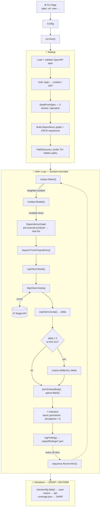
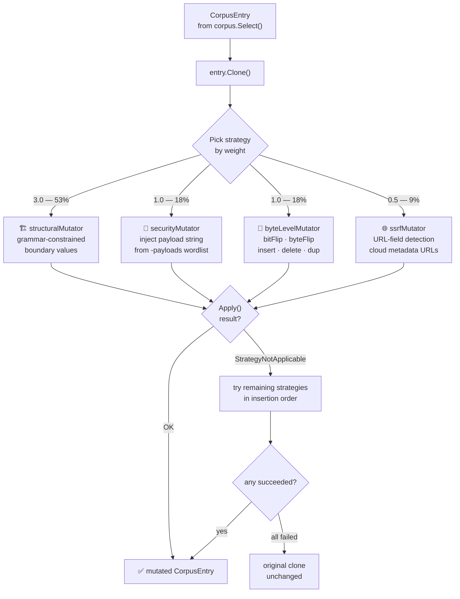
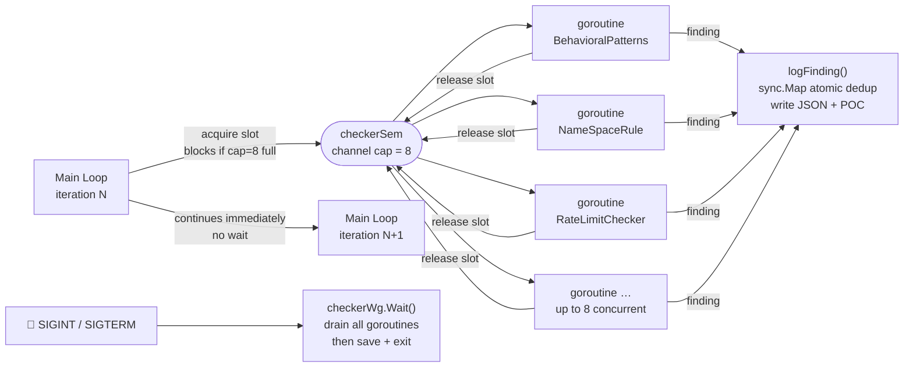

# Architecture

shelob-ng is a coverage-guided REST API security fuzzer written in Go. This document describes
the internal architecture, data flow, concurrency model, and design decisions.

---

## Overview



> `*` RateLimitChecker is stateful — it persists hit counts across calls.

---

## Package Map

```
shelob-ng/
├── main.go                   calls run.Run(); no logic
├── cliArgs/                  CLI flag definitions → Config struct
├── openapi/                  spec loading (kin-openapi), gorilla/mux router
├── run/                      main fuzzing loop + all wiring
├── auth/                     POST /login → extract cookies/JWT
├── corpus/
│   ├── entry.go              CorpusEntry, Hash(), Clone(), entryWeight()
│   ├── corpus.go             weightedCorpus: Add/Select, 15k cap, eviction
│   ├── selection.go          prefix-sum O(log n) weighted random selection
│   ├── pool.go               DynamicValuePool: per-key ring buffer (256)
│   ├── seed.go               SeedFromSpec: 3 random entries per operation
│   ├── dependency.go         DependencyGraph: producer → consumer bindings
│   └── storage.go            Save/Load JSON corpus to/from disk
├── mutator/
│   ├── mutator.go            Mutator interface, weighted orchestration
│   ├── schema_index.go       SchemaIndex: constraint lookup by (method, path, loc, name)
│   ├── structural.go         grammar-constrained + type-aware edge cases
│   ├── bytelevel.go          6 byte-level ops on raw body
│   ├── security.go           inject payload strings from wordlist files
│   ├── ssrf.go               inject SSRF URLs into URL-typed body fields
│   ├── fieldpicker.go        field selection by location; body 2× weight
│   ├── jsonmutate.go         dotted-path JSON leaf access/mutation
│   └── payloads/             external wordlist loader (Set, Random)
├── coverage/
│   ├── coverage.go           Client interface, Config, Snapshot
│   ├── csp.go                cspClient: HTTP Reset/Dump calls
│   └── noop.go               noopClient: when CSP disabled
├── checkers/
│   ├── checker.go            Finding, CheckContext, Checker interface, All()
│   ├── poc.go                BuildCurlPOC, ApplyAuth, buildProbeWithCookies
│   ├── behavioral.go         regex patterns: SQL/XSS/LFI/cmdi/SSTI/traces/SSRF
│   ├── invaliddyn.go         boundary path param probes
│   ├── useafterfree.go       DELETE → GET probe
│   ├── leakage.go            POST 4xx → GET probe
│   ├── namespace.go          BOLA/IDOR user2 replay
│   ├── bfla.go               role-boundary user2 probe on privileged paths
│   ├── authbypass.go         anonymous probe vs spec security declarations
│   ├── schema.go             OpenAPI response validation
│   ├── ratelimit.go          stateful burst probe: authThreshold=5, general=20
│   ├── massassignment.go     poison fields injection + reflection check
│   └── redos.go              timing ratio: ≥5× and ≥500ms
├── pathscan/
│   ├── pathscan.go           Scanner: probe hidden paths, classify findings
│   └── wordlist.go           70+ built-in paths + ParseWordlistLine()
├── sequence/
│   ├── builder.go            derive CRUD sequences + DependencyGraph
│   ├── sequence.go           Runner.Run(): multi-step stateful execution
│   └── replay.go             SaveReplay: persist steps + findings to JSON
├── request/
│   └── from_entry.go         build *http.Request from CorpusEntry; ApplyAuth
├── apicov/
│   └── apicov.go             visited/succeeded counters per OpenAPI operation
├── reporting/
│   └── sarif.go              WriteSARIF: SARIF 2.1.0, ReadFindingsDir
├── generateInput/
│   └── generateInput.go      schema-aware random generation; resolveComposed()
├── ui/
│   └── ui.go                 libfuzzer-style event display (INITED/NEW/FINDING/DONE)
└── adapters/
    ├── nodejs/               V8 Inspector CSP adapter (production-ready)
    ├── go/                   runtime/coverage adapter (Go 1.21+)
    ├── python/               coverage.py adapter
    └── c/                    gcov + libmicrohttpd adapter
```

---

## Main Loop

Pseudocode for `run.Run()` after startup:

```
seenFindings = sync.Map{}

// Pre-scan
findings = pathscan.Scanner.Scan(ctx)
for f in findings: logFinding(f, outputDir, &seenFindings)

// Main loop
start = time.Now()
seqTick = 0

while time.Since(start) < duration && ctx.Done() == nil:
    // RPS throttle
    if rps > 0: wait for ticker

    // Select and mutate
    entry = corpus.Select()
    mutated = mutator.Mutate(entry.Clone())

    // Pre-execute producer if consumer needs a real ID
    if binding = depGraph.FindBinding(mutated.PathPattern):
        producerResp = execute(binding.ProducerEntry)
        if id = ExtractJSONField(producerResp.Body, binding.IDField):
            mutated.PathParams[binding.PathParam] = id
        pool.Extract(producerResp.Body)

    // Build + send request
    req = request.FromCorpusEntry(mutated, targetURL, authCookies, apiKey, token)
    cspClient.Reset(ctx)
    resp, body = httpClient.Do(req)
    snapshot = cspClient.Dump(ctx)
    delta = snapshot.Delta()

    // Corpus admission
    effectiveDelta = delta
    if effectiveDelta == 0 && opTracker.isFirstSuccess(mutated):
        effectiveDelta = 1   // synthetic novelty: first 2xx for this operation
    if effectiveDelta > 0:
        corpus.Add(mutated, effectiveDelta)

    // Extract values from response
    pool.Extract(body)
    opTracker.Mark(mutated, resp.StatusCode)
    display.Request(resp.StatusCode, effectiveDelta, corpus.Size(), ...)

    // Runtime dependency learning
    if mutated.Method == POST && resp.StatusCode in 200..299:
        sequence.LearnProducer(depGraph, mutated.PathPattern, body, spec)

    // Run checkers concurrently
    for checker in activeCheckers:
        go func(chk, entry, req, resp, body):
            checkerSem <- token           // acquire slot (cap 8)
            findings = chk.Check(ctx, checkCtx, entry, req, resp, body)
            for f in findings:
                if logFinding(f, outputDir, &seenFindings):
                    display.Finding(...)
            <-checkerSem                  // release slot

    // Periodic sequence run (every 20 iterations)
    seqTick++
    if seqTick % 20 == 0:
        seq = seqs[(seqTick/20) % len(seqs)]
        findings, replay = seqRunner.Run(ctx, seq)
        sequence.SaveReplay(replay, outputDir)
        for f in findings: logSequenceFinding(...)

checkerWg.Wait()
display.Done()
opTracker.Print(os.Stdout)
opTracker.SaveJSON(outputDir + "/api-coverage.json")
if sarifOut != "": reporting.WriteSARIF(sarifOut, outputDir, specName)
if corpusDir != "": corpus.Save(corpusDir)
```

---

## Corpus Entry

The `CorpusEntry` is the fundamental unit of state. It represents one reproducible HTTP request:

```go
type CorpusEntry struct {
    Method       string                 // "GET", "POST", "DELETE", ...
    PathPattern  string                 // "/api/Users/{id}" — OpenAPI template
    OperationID  string                 // from spec operationId
    PathParams   map[string]interface{} // {"id": int64(42)} — preserves type
    QueryParams  map[string]string
    HeaderParams map[string]string
    CookieParams map[string]string
    Body         []byte                 // raw JSON/XML/binary
    ContentType  string                 // "application/json"

    // Corpus metadata (not hashed, not serialized as part of identity)
    CoverageDelta uint64   // new V8 blocks when added; 0 for seeds
    UseCount      uint64   // times selected; drives weight decay
    Generation    uint32   // 0 = seed from spec; increments per mutation
}
```

### Selection Weight

```
weight(e) = log2(1 + e.CoverageDelta) / log2(2 + e.UseCount)
```

Seeds have `CoverageDelta = 1` (minimum non-zero). The denominator grows with `UseCount`,
implementing adaptive cooling: frequently-used entries lose priority so the fuzzer explores
the full corpus rather than fixating on a few high-delta inputs.

### Deduplication Key (Finding)

```
key = checker + "\x00" + method + "\x00" + PathPattern
```

`PathPattern` is used instead of the concrete URL so that multiple mutations
to the same endpoint (e.g. `/api/Users/42` vs `/api/Users/99`) produce exactly
one finding file per vulnerability class.

---

## Mutation Pipeline



### Strategy: Structural

Picks one field (path, query, header, cookie, or body; body has 2× weight).

For each field, the `SchemaIndex` is consulted:
- **Constrained (schema declares bounds):** 70% valid value within bounds, 30% one step outside.
- **Unconstrained:** type-specific edge cases (empty string, max int, null byte, etc.).

For body fields:
- `bodyAddField`: inject `__proto__`, `$where`, `admin: true` (mass assignment surface)
- `bodyRemoveField`: remove random leaf (test missing-field handling)
- `bodyMutateLeaf`: mutate a random leaf value

### Strategy: Security

Requires `-payloads key=path,...` to be set. Injects one payload from a loaded
wordlist into one string-typed field. Applies to path/query/header/cookie/body
(leaf nodes via dotted-path traversal).

Returns `StrategyNotApplicable` when no payload files are loaded.

### Strategy: Byte-Level

Operates on raw `Body` bytes. One of 6 ops chosen uniformly:
`bitFlip`, `byteFlip` (XOR 0xFF), `insertion`, `deletion`, `duplication`, `interesting`
(replace with boundary byte: 0x00/0x01/0x7F/0x80/0xFE/0xFF).

Returns `StrategyNotApplicable` when body is empty.

### Strategy: SSRF (built-in)

Detects URL-typed body fields by:
1. Name matching: `url`, `uri`, `link`, `href`, `src`, `api`, `endpoint`, `callback`,
   `webhook`, `redirect`, `mechanic_api`, or any name ending in `_url`, `_api`, `_callback`, etc.
2. Value matching: field value starts with `http://` or `https://`

Replaces with one of 15 SSRF payloads targeting AWS/GCP/Azure metadata endpoints
and localhost variants. Weight = 0.5 (fires on ~10% of mutations).

---

## Checker Concurrency Model



The semaphore cap of 8 prevents unbounded goroutine growth when the target API
is slow. If all 8 slots are occupied (e.g., 8 checkers each waiting on a 15-second
probe timeout), the main loop will block for up to 15 seconds. This is a known
tradeoff — raising the cap increases memory and connection pressure.

### logFinding Guarantees

```go
func logFinding(f Finding, outDir string, seen *sync.Map) bool {
    // 1. MkdirAll — fail means dir unavailable; don't poison key
    if err := os.MkdirAll(findingsDir, 0755); err != nil { return false }

    // 2. Marshal — fail means data corrupt; don't poison key
    data, err := json.MarshalIndent(f, "", "  ")
    if err != nil { return false }

    // 3. LoadOrStore — atomically claim this (checker, method, path) key
    if _, loaded := seen.LoadOrStore(key, struct{}{}); loaded { return false }

    // 4. WriteFile — if fails, release key so a retry is possible
    if err := os.WriteFile(path, data, 0644); err != nil {
        seen.Delete(key)
        return false
    }
    return true  // display.Finding called only here
}
```

This ordering ensures: (a) no finding is lost to a transient I/O error, (b) no
key is permanently poisoned by an error that occurs before the key is claimed.

---

## Dependency Graph

The dependency graph maps consumer operations to their producers, enabling
shelob-ng to pre-execute the creator before each consumer request so path
parameters carry real resource IDs.

### Build Phase (startup)

```
For each path in spec:
  If POST /X exists AND GET|PUT|DELETE /X/{param} exists:
    Inspect POST 200 response schema for id/uuid/key/slug fields
    If found → register ProducerBinding{
        ConsumerPattern: "/X/{param}",
        PathParam:       "param",
        ProducerPattern: "/X",
        IDField:         "id"  (or uuid, key, slug)
    }
```

### Runtime Learning

When the spec lacks response schemas (common for brownfield APIs), learning
happens at runtime after the first successful POST:

```go
func LearnProducer(graph *DependencyGraph, pattern string, body []byte, spec *openapi3.T) {
    fields := ExtractIDFields(body)  // top-level + data.* wrapper
    for _, field := range fields {
        child := findChildPath(spec, pattern)
        if child != "" {
            graph.RegisterIfAbsent(child, ProducerBinding{...})
        }
    }
}
```

### Execution

Before building a consumer request:
1. Look up `depGraph.FindBinding(mutated.PathPattern)`
2. Execute the producer request (same auth, fresh random body)
3. Extract the ID field from the producer response
4. Inject as `mutated.PathParams[binding.PathParam]`
5. Also feed producer response body into `pool.Extract()` for future reuse

---

## DynamicValuePool

Maintains a per-field-key ring buffer of server-assigned values extracted from
response bodies. Reuses real values as path parameters 70% of the time.

```
pool.Extract(body):
  Walk JSON response body recursively
  For each string/number leaf:
    pool.store[key].push(value)   // ring buffer, 256 entries per key
    if len > 256: evict oldest

pool.GetValue(key):
  with 70% probability: return pool.store[key].random()
  with 30% probability: return nil  (caller generates random value)
```

The 70/30 split ensures the fuzzer never gets stuck only using server-assigned
values — it still exercises randomly generated inputs that may expose range
validation bugs.

---

## PathDiscovery Pre-Scan

Runs once before the main fuzzing loop:

```go
scanner := pathscan.New(httpClient, targetURL, authCookies, apiKey, token, extra)
findings := scanner.Scan(ctx)  // 60-second timeout
for _, f := range findings {
    logFinding(f, outputDir, &seenFindings)
}
```

For each candidate path, one unauthenticated GET is sent. Classification:

| Response | Body content | Finding |
|----------|-------------|---------|
| 2xx | Contains `SECRET_KEY`, `DATABASE_URL`, `"password":`, `process.env.` | HIGH — sensitive data exposed |
| 2xx | Contains `admin`, `password`, `secret`, `env`, `config` | MEDIUM — unauthenticated sensitive endpoint |
| 403 | Path contains `admin` in description | INFO — admin endpoint exists, IP-restricted |
| 404 | any | No finding |

The 60-second budget covers 70+ built-in paths at typical network latencies.
The `-path-wordlist` flag appends additional candidates (tab-separated path + description).

---

## Signal Handling

shelob-ng registers for `SIGINT` and `SIGTERM`. On receipt:

```
signal received
    → runCancel()           // cancel main loop context
    → main loop exits cleanly after current iteration
    → checkerWg.Wait()      // drain outstanding checker goroutines
    → save corpus (if -corpus-dir)
    → write api-coverage.json
    → write SARIF (if -sarif)
    → display.Done()
```

This ensures `api-coverage.json` and the corpus are always consistent on interrupt,
unlike a `SIGKILL` which bypasses the handler entirely.

---

## Auth Flow

```
auth.Login(username, password, targetURL, loginEndpoint):
  1. Detect login endpoint from spec:
     - Path matches: /login, /users/login, /user/login, /api/login, /auth/login,
                     /users/v1/login, /api/v3/user/login
     - Or: operationId contains "login" or "authenticate"
     - Fallback: /api/v3/user/login
  2. POST {"email": username, "password": password}
     Also try: {"username": username, "password": password}
               {"user": username, "password": password}
  3. Extract cookies from Set-Cookie headers
  4. Extract JWT from response body:
     - authentication.token
     - token
     - access_token
     - auth_token
  5. Return (cookies, token)
```

If `-token` is set explicitly: skip login, use the provided token directly.
If login returns a JWT and `-token` is not set: use the JWT as the Bearer token.
This means authenticated endpoints accepting only `Authorization: Bearer` are
reached without requiring an explicit `-token` flag.

---

## API Coverage Tracking

`apicov.Tracker` maintains two counters per OpenAPI operation:

- **visited:** incremented on any HTTP response (even 404, 500)
- **succeeded:** incremented on the first 2xx response

At run end:
```json
{
  "total": 14,
  "visited_count": 14,
  "succeeded_count": 8,
  "unvisited_count": 0,
  "visited": [
    {"method": "POST", "path": "/users/v1/login", "operationId": "usersLogin", "status_codes": {"200": 12, "401": 45}}
  ],
  "unvisited": []
}
```

The gap between `visited_count` and `succeeded_count` reveals endpoints that were
reached but never returned 2xx — typically because they require a prerequisite
resource (no producer bound), a specific auth role, or crash on all inputs.

---

## Key Design Decisions

### Why gorilla/mux for routing?

The OpenAPI spec defines path patterns (e.g., `/api/Users/{id}`). When checking
a response, shelob-ng needs to map a concrete URL back to its OpenAPI pattern
to look up the declared response schema. `gorilla/mux` provides this reverse
routing cheaply.

### Why sync.Map for finding deduplication?

Multiple checker goroutines run concurrently and may discover the same finding
simultaneously. `sync.Map.LoadOrStore` provides an atomic compare-and-swap that
ensures exactly one goroutine writes the finding file — without a mutex
that would serialize all checker goroutines.

### Why depth-5 cap for schema generation?

Kubernetes and similar complex APIs define schemas with deeply recursive `$ref`
chains. Without a cap, `GenerateRandomDataModels` would stack-overflow. Depth 5
covers virtually all real-world API schemas while preventing infinite recursion.

### Why 70% real / 30% random in DynamicValuePool?

Pure exploitation (100% real IDs) causes the fuzzer to only ever test the same
resources, missing input validation bugs. Pure exploration (100% random) wastes
most requests on 404s. The 70/30 split empirically balances coverage and depth.
