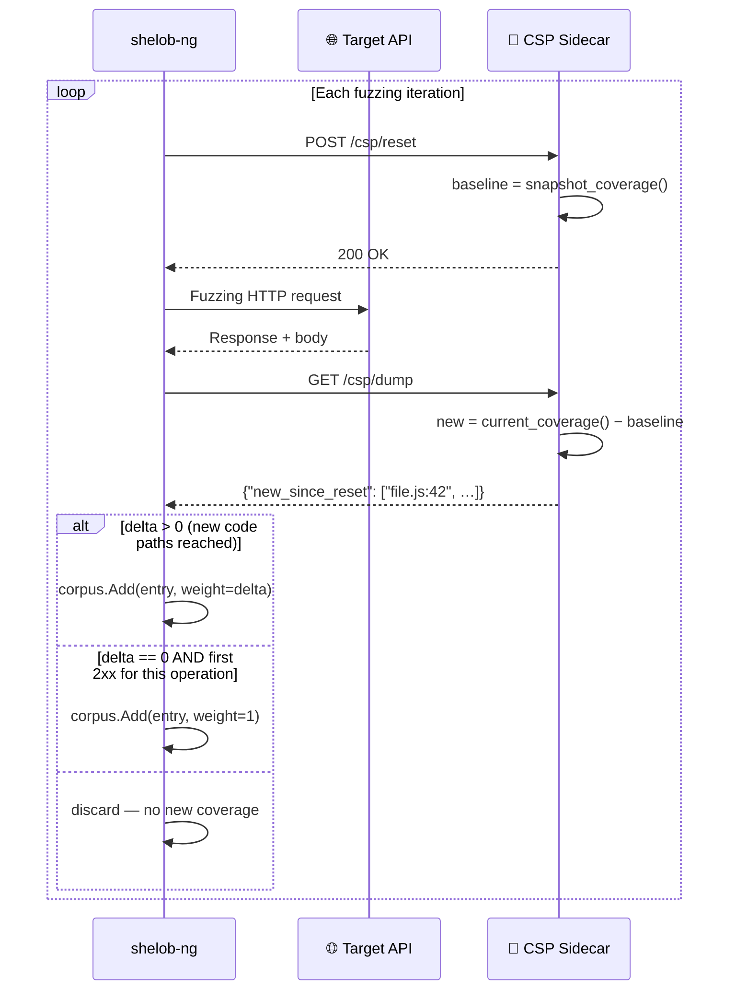

# Coverage Sidecar Protocol (CSP)

The Coverage Sidecar Protocol (CSP) is a minimal HTTP API that exposes per-request
code coverage from a target application to shelob-ng. It requires no modification
of the application's source code — only a thin companion process (the "sidecar").

---

## Why Coverage Feedback?

Without coverage feedback, shelob-ng operates in **pure-random mode**: it generates
inputs and looks for anomalous responses, but has no signal about which inputs
exercise new code paths. Coverage feedback enables **corpus-guided fuzzing**:

- Inputs that reach new code blocks are saved to the corpus and preferentially mutated
- The fuzzer concentrates effort on exploring unexplored code paths
- Deep logic bugs (reachable only through specific input sequences) become findable

---

## Protocol Endpoints

A CSP sidecar must implement exactly two HTTP endpoints:

### POST /csp/reset

Called **before** each fuzzing request. Snapshots current coverage as a baseline.

**Request:** any body (ignored)
**Response:** `200 OK` (body ignored by shelob-ng)

### GET /csp/dump

Called **after** each fuzzing request. Returns lines/blocks covered since the last reset.

**Request:** no body
**Response:** `200 OK` with JSON:

```json
{
    "total_lines":     12400,
    "covered_lines":   3847,
    "new_since_reset": ["routes/users.js:142", "db/query.js:87"],
    "bitmap":          "<base64-encoded bitset, optional>"
}
```

| Field | Type | Required | Description |
|-------|------|---------|-------------|
| `total_lines` | integer | no | Total instrumented lines/blocks |
| `covered_lines` | integer | no | Total covered so far |
| `new_since_reset` | string[] | **yes** | Lines/blocks executed since last reset |
| `bitmap` | string | no | Base64-encoded bitset (unused by shelob-ng currently) |

shelob-ng uses `delta = len(new_since_reset)`. When `delta > 0`, the triggering
corpus entry is saved with that delta as its coverage weight.

---

## Lifecycle



---

## Adapters

### Node.js (V8 Inspector)

**Location:** `adapters/nodejs/adapter.js`

Uses the V8 Inspector `Profiler.startPreciseCoverage` API. Production-ready —
already used by the Juice Shop CSP scenario.

```javascript
const http = require('http');
const inspector = require('inspector');

const session = new inspector.Session();
session.connect();

let baseline = new Set();

session.post('Profiler.enable', () => {
    session.post('Profiler.startPreciseCoverage', { callCount: false, detailed: true });
});

function getNewSinceReset() {
    return new Promise(resolve => {
        session.post('Profiler.takePreciseCoverage', (err, data) => {
            const current = new Set();
            for (const script of data.result) {
                for (const fn of script.functions) {
                    for (const range of fn.ranges) {
                        if (range.count > 0) {
                            current.add(`${script.url}:${range.startOffset}`);
                        }
                    }
                }
            }
            const newBlocks = [...current].filter(b => !baseline.has(b));
            resolve(newBlocks);
        });
    });
}

const server = http.createServer(async (req, res) => {
    if (req.method === 'POST' && req.url === '/csp/reset') {
        baseline = await getCurrentCoverage();
        res.writeHead(200); res.end();
    } else if (req.method === 'GET' && req.url === '/csp/dump') {
        const newBlocks = await getNewSinceReset();
        res.writeHead(200, {'Content-Type': 'application/json'});
        res.end(JSON.stringify({new_since_reset: newBlocks}));
    }
});

server.listen(8080);
```

**Usage with shelob-ng:**
```bash
# Start target + sidecar
node adapter.js &
node server.js   # your target

# Run fuzzer
./shelob-ng -spec api.json -url http://localhost:3000 -csp-url http://localhost:8080
```

### Go (runtime/coverage)

**Location:** `adapters/go/adapter.go`

Uses `runtime/coverage` (Go 1.21+). Build the target with `-cover`.

```go
package main

import (
    "encoding/json"
    "net/http"
    "runtime/coverage"
    "os"
    "path/filepath"
)

var coverageDir string

func init() {
    coverageDir, _ = os.MkdirTemp("", "csp-coverage-*")
}

type cspHandler struct{}

func (h *cspHandler) ServeHTTP(w http.ResponseWriter, r *http.Request) {
    switch r.URL.Path {
    case "/csp/reset":
        coverage.ClearCounters()
        w.WriteHeader(200)

    case "/csp/dump":
        // Write current coverage to temp dir
        os.RemoveAll(coverageDir)
        os.MkdirAll(coverageDir, 0755)
        coverage.WriteCountersDir(coverageDir)

        // Read and count new blocks
        newBlocks := readNewBlocks(coverageDir)
        w.Header().Set("Content-Type", "application/json")
        json.NewEncoder(w).Encode(map[string]interface{}{
            "new_since_reset": newBlocks,
        })
    }
}
```

**Build the target with coverage instrumentation:**
```bash
go build -cover -o myapp .
GOCOVERDIR=/tmp/cov ./myapp
```

### Python (coverage.py)

**Location:** `adapters/python/adapter.py`

Uses `coverage.py` for line-level coverage.

```python
import coverage
import json
from http.server import HTTPServer, BaseHTTPRequestHandler

cov = coverage.Coverage()
cov.start()
baseline_lines = set()

class CSPHandler(BaseHTTPRequestHandler):
    def do_POST(self):
        if self.path == '/csp/reset':
            global baseline_lines
            data = cov.get_data()
            baseline_lines = set(
                f"{fn}:{line}"
                for fn, lines in data.lines(data.measured_files()).items()
                if lines
                for line in lines
            )
            self.send_response(200)
            self.end_headers()

    def do_GET(self):
        if self.path == '/csp/dump':
            data = cov.get_data()
            current = set(
                f"{fn}:{line}"
                for fn, lines in data.lines(data.measured_files()).items()
                if lines
                for line in lines
            )
            new_since_reset = list(current - baseline_lines)
            self.send_response(200)
            self.send_header('Content-Type', 'application/json')
            self.end_headers()
            self.wfile.write(json.dumps({
                "new_since_reset": new_since_reset
            }).encode())

    def log_message(self, *args): pass  # suppress request logging

HTTPServer(('', 8080), CSPHandler).serve_forever()
```

**Start with coverage enabled:**
```bash
# Option 1: run target under coverage
python -m coverage run --branch myapp.py &
python adapter.py &

# Option 2: monkeypatch sitecustomize.py
echo "import coverage; coverage.process_startup()" > sitecustomize.py
COVERAGE_PROCESS_START=.coveragerc python adapter.py &
```

### C / C++ (gcov)

**Location:** `adapters/c/adapter.c`

Uses `gcov` counters via `__gcov_dump()` / `__gcov_reset()`.

```c
#include <stdio.h>
#include <string.h>
#include <microhttpd.h>

// Provided by libgcov when compiled with -fprofile-arcs -ftest-coverage
extern void __gcov_dump(void);
extern void __gcov_reset(void);

// Parse gcov .gcda files to count covered arcs
static int count_covered_arcs(void) {
    /* implementation: walk *.gcda files in current dir,
       sum up non-zero arc counters */
    return 0; // stub
}

static int csp_handler(void *cls, struct MHD_Connection *conn,
    const char *url, const char *method, ...)
{
    if (strcmp(url, "/csp/reset") == 0 && strcmp(method, "POST") == 0) {
        __gcov_reset();
        struct MHD_Response *r = MHD_create_response_from_buffer(0, "", MHD_RESPMEM_STATIC);
        return MHD_queue_response(conn, 200, r);
    }
    if (strcmp(url, "/csp/dump") == 0 && strcmp(method, "GET") == 0) {
        __gcov_dump();
        int covered = count_covered_arcs();
        char body[256];
        snprintf(body, sizeof(body),
            "{\"new_since_reset\": %d, \"covered_lines\": %d}", covered, covered);
        struct MHD_Response *r = MHD_create_response_from_buffer(
            strlen(body), body, MHD_RESPMEM_MUST_COPY);
        return MHD_queue_response(conn, 200, r);
    }
    return MHD_NO;
}

int main(void) {
    struct MHD_Daemon *d = MHD_start_daemon(
        MHD_USE_THREAD_PER_CONNECTION, 8080, NULL, NULL,
        &csp_handler, NULL, MHD_OPTION_END);
    pause();
}
```

**Compile target with gcov:**
```bash
gcc -fprofile-arcs -ftest-coverage -o myapp myapp.c adapter.c -lmicrohttpd
./myapp &
```

---

## Implementing a Custom Adapter

Any HTTP server that implements the two endpoints is a valid adapter.
The minimal contract:

```
state: baseline = empty set

POST /csp/reset:
    baseline = snapshot_of_current_coverage()
    return 200

GET /csp/dump:
    current = snapshot_of_current_coverage()
    new_since_reset = current - baseline
    return 200, {"new_since_reset": list(new_since_reset)}
```

### Coverage representation

`new_since_reset` is an array of strings. Each string uniquely identifies a
covered code unit. Common representations:

- **Line-level:** `"filename.py:142"` (Python, C with gcov line counters)
- **Block-level:** `"filename.js:offset"` (V8 basic block offsets)
- **Function-level:** `"package.FunctionName"` (coarse, but functional)
- **Arc-level:** `"filename.c:arc_42"` (gcov arc coverage)

The exact format does not matter to shelob-ng — it only counts `len(new_since_reset)`.
The strings are not parsed further.

### Performance considerations

The `POST /csp/reset` and `GET /csp/dump` calls happen on **every** fuzzing
iteration, potentially thousands of times per second. The adapter must be fast:

- Prefer in-memory snapshots over file I/O
- For file-based coverage (gcov, Go), use temp directories on a RAM disk
- The Go adapter uses `coverage.ClearCounters()` which is O(n) in instrumented blocks
  — acceptable for targets with < 100k functions

---

## Disabling CSP

Pass `-csp-disable` to force pure-random mode regardless of `-csp-url`:

```bash
./shelob-ng -spec api.json -url http://target -csp-disable
```

Without CSP, the `cov:` display column tracks first-2xx-per-operation events only,
and the corpus grows only from API-level novelty signals.

---

## Troubleshooting

| Symptom | Cause | Fix |
|---------|-------|-----|
| `cov:` stays at 0 | CSP not receiving calls | Check `-csp-url` value; ensure sidecar is running |
| `new_since_reset: []` always | `__gcov_reset()` not effective | Use `__gcov_dump()` + `__gcov_reset()` in correct order |
| Very high delta (millions) on first request | Baseline not set before request | Ensure `reset` is called before the target processes the request |
| Adapter crashes under load | Thread safety | Protect coverage data structures with a mutex |
| 15-second timeout on `/csp/dump` | File I/O blocking | Move gcda files to tmpfs; or use in-memory counters |
