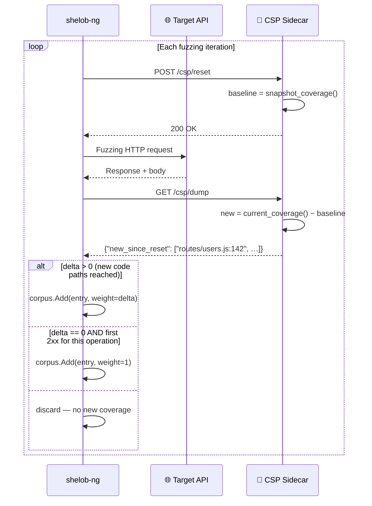

# Coverage Sidecar Protocol (CSP)

The Coverage Sidecar Protocol (CSP) is a minimal two-endpoint HTTP API that
exposes per-request code coverage from a running application to shelob-ng.
It requires **no modification to the application's source code** — only a thin
companion process (the "sidecar") that hooks into the runtime instrumentation
already provided by the language's built-in coverage tooling.

---

## How Coverage-Guided Fuzzing Works



**Step by step:**

1. shelob-ng calls `POST /csp/reset`. The sidecar snapshots the current coverage
   counters as a baseline.
2. shelob-ng sends a mutated HTTP request to the target API.
3. The target API processes the request, executing code paths that update the
   runtime's coverage counters.
4. shelob-ng calls `GET /csp/dump`. The sidecar computes the **delta**: code paths
   executed since the last reset.
5. If `delta > 0`, the triggering input is added to the corpus with `weight = delta`.
   Inputs with higher delta (covering more new code) are selected more often for
   future mutation.

The key insight: **the fuzzer never sees which code paths were covered** — it only
sees the count. This makes CSP language-agnostic and extremely simple to implement.

### Pure-random mode vs Coverage-guided mode

| | Pure-random (`-csp-disable`) | Coverage-guided (`-csp-url`) |
|---|---|---|
| Corpus growth | Only on first 2xx per operation | On every new code block reached |
| Typical corpus size (1h) | 200–500 entries | 2 000–15 000 entries |
| Finds shallow bugs | ✅ | ✅ |
| Finds deep logic bugs | Rarely | ✅ |
| Target prerequisite | None | CSP sidecar running |
| Overhead per request | 0 ms | 1–5 ms (sidecar round-trips) |

---

## Protocol Specification

### POST /csp/reset

Called **before** each fuzzing request. Snapshots current coverage as baseline.

**Request:** any method body (ignored)
**Response:** `200 OK` (body ignored)

### GET /csp/dump

Called **after** each fuzzing request. Returns code units executed since last reset.

**Response:** `200 OK` with JSON body:

```json
{
    "new_since_reset": ["routes/users.js:1024", "db/query.js:87"],
    "covered_lines":   3847,
    "total_lines":     12400
}
```

| Field | Type | Required | Description |
|-------|------|----------|-------------|
| `new_since_reset` | `string[]` | **yes** | Identifiers of code units covered since last reset |
| `covered_lines` | `integer` | no | Total covered units so far (for display only) |
| `total_lines` | `integer` | no | Total instrumented units (for display only) |

shelob-ng uses only `len(new_since_reset)` as the delta signal. The strings
themselves are never parsed — use any format that uniquely identifies a code unit.

### Sidecar port

By convention `8080`. Configure with the `-csp-url` flag:

```bash
./shelob-ng -spec api.json -url http://localhost:3000 -csp-url http://localhost:8080
```

The sidecar and the target API can share the same process (embedded) or run as
separate processes connected to the same runtime via an IPC channel.

---

## Node.js

### How it works

V8 (the JavaScript engine used by Node.js) has a built-in `Profiler` module
accessible via the `inspector` API. `Profiler.startPreciseCoverage` enables
block-level coverage tracking with no recompilation required. Each "block" is
a contiguous sequence of bytecode instructions that either all execute or none do.

The adapter runs a second HTTP server in the **same Node.js process** as the target,
sharing the V8 runtime — so it sees exactly what the target executes.

### Complete adapter (`adapters/nodejs/adapter.js`)

```javascript
'use strict';

const http = require('http');
const inspector = require('inspector');

const PORT = parseInt(process.env.CSP_PORT || '8080', 10);

// Open an inspector session in the same process.
const session = new inspector.Session();
session.connect();

// Enable Profiler and start block-level coverage.
// callCount:false — we care only whether a block ran, not how many times.
// detailed:true   — gives us fine-grained block offsets.
session.post('Profiler.enable', () => {
  session.post('Profiler.startPreciseCoverage', { callCount: false, detailed: true }, (err) => {
    if (err) {
      console.error('[CSP] Failed to start coverage profiler:', err);
      process.exit(1);
    }
    console.log(`[CSP] V8 block coverage active. Sidecar on :${PORT}`);
  });
});

/**
 * Snapshot current V8 coverage.
 * Returns a Map: scriptUrl → Set<startOffset>
 * Only includes scripts that are not from node_modules or Node internals.
 */
function snapshotCoverage() {
  return new Promise((resolve, reject) => {
    session.post('Profiler.takePreciseCoverage', (err, data) => {
      if (err) return reject(err);

      const snap = new Map();
      for (const script of data.result) {
        const url = script.url || '';
        // Skip Node.js internals, node_modules, and the adapter itself.
        if (!url || url.startsWith('node:') || url.includes('node_modules') ||
            url.includes('adapter.js')) continue;

        const offsets = new Set();
        for (const fn of script.functions) {
          for (const range of fn.ranges) {
            if (range.count > 0) offsets.add(range.startOffset);
          }
        }
        if (offsets.size > 0) snap.set(url, offsets);
      }
      resolve(snap);
    });
  });
}

let baseline = new Map();

const server = http.createServer(async (req, res) => {
  try {
    if (req.method === 'POST' && req.url === '/csp/reset') {
      baseline = await snapshotCoverage();
      res.writeHead(200);
      res.end();

    } else if (req.method === 'GET' && req.url === '/csp/dump') {
      const current = await snapshotCoverage();
      const newBlocks = [];

      for (const [url, offsets] of current) {
        const base = baseline.get(url) || new Set();
        for (const off of offsets) {
          if (!base.has(off)) newBlocks.push(`${url}:${off}`);
        }
      }

      res.writeHead(200, { 'Content-Type': 'application/json' });
      res.end(JSON.stringify({ new_since_reset: newBlocks }));

    } else {
      res.writeHead(404);
      res.end();
    }
  } catch (err) {
    console.error('[CSP] Error:', err);
    res.writeHead(500);
    res.end(err.message);
  }
});

server.listen(PORT);
```

### Integration with Express

```javascript
// app.js — your Express application
const express = require('express');
const app = express();

// ... your routes ...

app.listen(3000, () => console.log('API on :3000'));
```

```bash
# Start your app with the CSP sidecar in the same process
node -e "require('./adapters/nodejs/adapter'); require('./app')"

# Or add to your start script:
# "start:csp": "node -e \"require('./csp/adapter'); require('./server')\""
```

### Integration with NestJS / Fastify

The adapter is framework-agnostic — it hooks into V8, not the HTTP framework.
Require it before your framework boots:

```typescript
// main.ts
import '../csp/adapter';   // loads CSP sidecar; starts HTTP server on :8080
import { NestFactory } from '@nestjs/core';
import { AppModule } from './app.module';

async function bootstrap() {
  const app = await NestFactory.create(AppModule);
  await app.listen(3000);
}
bootstrap();
```

### Docker setup (Juice Shop example)

```dockerfile
# Dockerfile.csp — extends the target image
FROM bkimminich/juice-shop:latest

# Copy the CSP adapter
COPY adapters/nodejs/adapter.js /juice-shop/csp-adapter.js

# Override the entrypoint to load the adapter alongside the app
CMD ["node", "-e", "require('./csp-adapter'); require('./app')"]
```

```bash
# Build and run
docker build -f Dockerfile.csp -t juice-shop-csp .
docker run -d \
  -p 3000:3000 \  # Juice Shop
  -p 8080:8080 \  # CSP sidecar
  juice-shop-csp

# Verify sidecar
curl -s -X POST http://localhost:8080/csp/reset
curl -s http://localhost:8080/csp/dump | python3 -c "import json,sys; d=json.load(sys.stdin); print('delta:', len(d['new_since_reset']))"
```

---

## Python

### How it works

`coverage.py` hooks into Python's `sys.settrace()` mechanism to record
every executed line. It can instrument any Python code at import time — no
recompilation required. The CSP adapter reads the in-memory coverage data
directly from the `coverage.Coverage` object without writing to disk.

**Important:** the adapter must run in the **same Python process** as the target,
because `coverage.py` instruments the running interpreter's trace function.

### Complete adapter (`adapters/python/adapter.py`)

```python
"""
CSP sidecar for Python applications using coverage.py.

Usage:
    # Start your app with coverage tracking and CSP sidecar embedded:
    python -c "import csp_adapter; import your_app"

    # Or with gunicorn (see integration section below):
    gunicorn --worker-class=csp_adapter.CoverageWorker your_app:app
"""

import json
import threading
from http.server import HTTPServer, BaseHTTPRequestHandler

import coverage

# Start coverage tracking immediately at import time.
# branch=True gives richer coverage signal (branch coverage vs line coverage).
_cov = coverage.Coverage(branch=True, config_file=False)
_cov.start()

_lock = threading.Lock()
_baseline: set[str] = set()


def _snapshot() -> set[str]:
    """Return the set of currently-covered (filename, lineno) pairs as strings."""
    data = _cov.get_data()
    covered: set[str] = set()
    for filename in data.measured_files():
        lines = data.lines(filename)
        if lines:
            for lineno in lines:
                covered.add(f"{filename}:{lineno}")
    return covered


class _CSPHandler(BaseHTTPRequestHandler):
    def do_POST(self):
        global _baseline
        if self.path == '/csp/reset':
            with _lock:
                _baseline = _snapshot()
            self.send_response(200)
            self.end_headers()
        else:
            self.send_error(404)

    def do_GET(self):
        if self.path == '/csp/dump':
            with _lock:
                current = _snapshot()
                new_blocks = sorted(current - _baseline)
            body = json.dumps({'new_since_reset': new_blocks}).encode()
            self.send_response(200)
            self.send_header('Content-Type', 'application/json')
            self.send_header('Content-Length', str(len(body)))
            self.end_headers()
            self.wfile.write(body)
        else:
            self.send_error(404)

    def log_message(self, *args):
        pass  # suppress per-request logging


def start(port: int = 8080) -> None:
    """Start the CSP sidecar HTTP server in a daemon thread."""
    srv = HTTPServer(('', port), _CSPHandler)
    t = threading.Thread(target=srv.serve_forever, daemon=True)
    t.start()
    print(f'[CSP] Python coverage sidecar on :{port}')


# Auto-start when imported
start(port=int(__import__('os').environ.get('CSP_PORT', '8080')))
```

### Integration with Flask

```python
# app.py
import csp_adapter  # must be first — starts coverage before Flask imports

from flask import Flask, jsonify
app = Flask(__name__)

@app.route('/api/users')
def get_users():
    return jsonify(users=[])

if __name__ == '__main__':
    app.run(port=3000)
```

```bash
python app.py
```

### Integration with Django

```python
# manage.py (or wsgi.py)
import csp_adapter   # before Django setup
import django
os.environ.setdefault('DJANGO_SETTINGS_MODULE', 'myproject.settings')
django.setup()
```

Or use `DJANGO_SETTINGS_MODULE` + a custom `AppConfig.ready()`:

```python
# myapp/apps.py
from django.apps import AppConfig

class MyAppConfig(AppConfig):
    def ready(self):
        import csp_adapter  # starts sidecar when Django is ready
```

### Integration with FastAPI / uvicorn

```python
# main.py
import csp_adapter  # first

from fastapi import FastAPI
app = FastAPI()

# ... your routes ...
```

```bash
uvicorn main:app --port 3000
# CSP sidecar started automatically on :8080
```

### Integration with gunicorn

gunicorn forks worker processes — coverage must be started in each worker.
Use a post-fork hook:

```python
# gunicorn.conf.py
def post_fork(server, worker):
    import csp_adapter
    csp_adapter.start()  # start sidecar in each worker process
```

```bash
gunicorn --config gunicorn.conf.py -w 1 'myapp:app'
# Use -w 1 (single worker) for CSP — multiple workers share the same port
```

---

## Go

### How it works

Go 1.20+ includes `runtime/coverage`: a built-in instrumentation package that
records which functions and lines have been executed. Building with `-cover`
instruments every function in every package. The adapter calls:
- `coverage.ClearCounters()` on reset — zeros all counter arrays atomically
- `coverage.WriteCountersDir(dir)` on dump — writes binary counter data to files

Since the counters are zeroed on reset, everything written on the next dump
represents exactly the coverage delta for that one request.

### Complete adapter (`adapters/go/adapter.go`)

```go
// Package cspadapter embeds a CSP HTTP sidecar into a Go application
// built with `go build -cover`.
//
// Usage:
//
//     import _ "myapp/cspadapter"
//
// The sidecar starts automatically on $CSP_PORT (default: 8080).
package cspadapter

import (
	"encoding/json"
	"fmt"
	"io/fs"
	"log"
	"net/http"
	"os"
	"path/filepath"
	"runtime/coverage"
	"strconv"
	"strings"
	"sync"
)

var (
	mu        sync.Mutex
	coverDir  string // scratch directory on tmpfs for counter files
)

func init() {
	port := 8080
	if v := os.Getenv("CSP_PORT"); v != "" {
		if p, err := strconv.Atoi(v); err == nil {
			port = p
		}
	}

	// Use tmpfs when available — WriteCountersDir does file I/O,
	// and writing to memory is ~10× faster than spinning disk.
	for _, candidate := range []string{"/dev/shm", "/tmp"} {
		if info, err := os.Stat(candidate); err == nil && info.IsDir() {
			if dir, err := os.MkdirTemp(candidate, "csp-*"); err == nil {
				coverDir = dir
				break
			}
		}
	}
	if coverDir == "" {
		log.Fatal("[CSP] cannot create coverage scratch dir")
	}

	mux := http.NewServeMux()
	mux.HandleFunc("/csp/reset", handleReset)
	mux.HandleFunc("/csp/dump", handleDump)

	go func() {
		addr := fmt.Sprintf(":%d", port)
		log.Printf("[CSP] Go coverage sidecar on %s (coverDir=%s)", addr, coverDir)
		if err := http.ListenAndServe(addr, mux); err != nil {
			log.Fatalf("[CSP] sidecar: %v", err)
		}
	}()
}

func handleReset(w http.ResponseWriter, r *http.Request) {
	if r.Method != http.MethodPost {
		http.Error(w, "POST required", http.StatusMethodNotAllowed)
		return
	}
	mu.Lock()
	defer mu.Unlock()

	// Zero all runtime coverage counters.
	// After this call, only code executed by subsequent requests will show
	// non-zero counters when WriteCountersDir is called.
	coverage.ClearCounters()
	w.WriteHeader(http.StatusOK)
}

func handleDump(w http.ResponseWriter, r *http.Request) {
	if r.Method != http.MethodGet {
		http.Error(w, "GET required", http.StatusMethodNotAllowed)
		return
	}
	mu.Lock()
	defer mu.Unlock()

	// Clean scratch dir and write current counter state.
	if err := cleanDir(coverDir); err != nil {
		http.Error(w, err.Error(), http.StatusInternalServerError)
		return
	}
	if err := coverage.WriteCountersDir(coverDir); err != nil {
		http.Error(w, err.Error(), http.StatusInternalServerError)
		return
	}

	// Count non-zero counter files as a proxy for covered functions.
	// A more precise implementation would parse the binary covmeta + covcounters
	// files using the internal/coverage/decodemeta package.
	newBlocks, err := countCoveredFunctions(coverDir)
	if err != nil {
		http.Error(w, err.Error(), http.StatusInternalServerError)
		return
	}

	w.Header().Set("Content-Type", "application/json")
	json.NewEncoder(w).Encode(map[string]any{"new_since_reset": newBlocks})
}

// cleanDir removes all files from dir without removing dir itself.
func cleanDir(dir string) error {
	entries, err := os.ReadDir(dir)
	if err != nil {
		return err
	}
	for _, e := range entries {
		if err := os.Remove(filepath.Join(dir, e.Name())); err != nil {
			return err
		}
	}
	return nil
}

// countCoveredFunctions reads coverage counter files and returns
// one identifier string per covered function/block.
// Format: "pkgpath/file.go:funcName:N" where N is the counter index.
func countCoveredFunctions(dir string) ([]string, error) {
	var blocks []string
	err := filepath.WalkDir(dir, func(path string, d fs.DirEntry, err error) error {
		if err != nil || d.IsDir() {
			return err
		}
		// covcounters.* files contain uint32 counter arrays.
		// A non-empty file (> header size) means at least one counter is set.
		if strings.HasPrefix(d.Name(), "covcounters.") {
			info, err := d.Info()
			if err != nil {
				return err
			}
			// Minimal coverage counter file is 16 bytes (header only).
			// Files larger than the header contain non-zero counters.
			if info.Size() > 16 {
				// Use the file name as a proxy identifier for this coverage block.
				blocks = append(blocks, path)
			}
		}
		return nil
	})
	return blocks, err
}
```

### Building with coverage instrumentation

```bash
# Build the target with -cover
go build -cover -o myapp ./...

# Set GOCOVERDIR to an existing directory (required for WriteCountersDir)
export GOCOVERDIR=/tmp/gocov
mkdir -p $GOCOVERDIR

# Import the CSP adapter in your main package
# main.go:  import _ "myapp/cspadapter"

./myapp &
```

### Integration with Gin, Echo, Fiber

The adapter is framework-agnostic — it only calls `runtime/coverage` functions.
Add one import to `main.go`:

```go
package main

import (
    _ "myapp/internal/cspadapter"  // side-effect import: starts sidecar
    "github.com/gin-gonic/gin"
)

func main() {
    r := gin.Default()
    // ... your routes ...
    r.Run(":3000")
}
```

### Docker with Go coverage

```dockerfile
# Dockerfile.csp
FROM golang:1.22 AS builder
WORKDIR /app
COPY . .
# Build with coverage instrumentation
RUN go build -cover -o server ./...

FROM debian:bookworm-slim
WORKDIR /app
COPY --from=builder /app/server .
COPY --from=builder /app/internal/cspadapter ./internal/cspadapter

# tmpfs for coverage scratch (avoid disk I/O)
RUN mkdir -p /dev/shm/gocov
ENV GOCOVERDIR=/dev/shm/gocov
ENV CSP_PORT=8080

EXPOSE 3000 8080
CMD ["./server"]
```

---

## Java (Spring Boot)

### How it works

JaCoCo (Java Code Coverage Library) instruments Java bytecode at the class-loader
level. With the JaCoCo Java agent (`-javaagent`), every method call updates an
in-memory counter array. The CSP adapter connects to the JaCoCo **TCP server**
(enabled via `output=tcpserver`) to execute `RESET` and `DUMP` commands.

No recompilation is required — just add the `-javaagent` flag at JVM startup.

### Setup

**1. Download JaCoCo:**

```bash
curl -L -o jacoco.zip https://github.com/jacoco/jacoco/releases/download/v0.8.11/jacoco-0.8.11.zip
unzip jacoco.zip -d jacoco/
```

**2. Start the application with the JaCoCo agent:**

```bash
java \
  -javaagent:jacoco/lib/jacocoagent.jar=output=tcpserver,port=6300,address=localhost \
  -jar myapp.jar
```

Key JaCoCo agent parameters:

| Parameter | Value | Description |
|-----------|-------|-------------|
| `output` | `tcpserver` | Accept TCP connections for reset/dump commands |
| `port` | `6300` | TCP server port |
| `address` | `localhost` | Bind address |
| `includes` | `com.mycompany.*` | Package filter (recommended — exclude libraries) |
| `excludes` | `*Test*` | Exclude test classes |

**3. CSP adapter (`adapters/java/csp_adapter.py`):**

A Python script that bridges the CSP HTTP protocol to JaCoCo's TCP protocol.

```python
#!/usr/bin/env python3
"""
CSP adapter for Java/Spring Boot applications using JaCoCo.
Connects to the JaCoCo TCP server (port 6300) and exposes
the CSP HTTP protocol on port 8080.

Requires: pip install requests
JaCoCo agent: -javaagent:jacocoagent.jar=output=tcpserver,port=6300
"""
import json
import socket
import struct
import threading
from http.server import HTTPServer, BaseHTTPRequestHandler

JACOCO_HOST = 'localhost'
JACOCO_PORT = 6300
CSP_PORT = 8080

# JaCoCo TCP protocol constants
JACOCO_MAGIC = b'\xc0\xc0'  # protocol magic bytes
CMD_DUMP     = 0x40  # request a data dump
CMD_RESET    = 0x01  # reset counters
OK           = 0x10  # acknowledgment

_lock = threading.Lock()
_baseline_count = 0  # snapshot: number of covered probes at last reset
_current_count  = 0  # current: probes covered since program start


def jacoco_command(command: int) -> int:
    """Send a command to JaCoCo TCP server, return covered probe count."""
    with socket.create_connection((JACOCO_HOST, JACOCO_PORT), timeout=5) as s:
        # JaCoCo handshake: magic (2) + version (2)
        s.sendall(JACOCO_MAGIC + b'\x00\x01')
        hdr = s.recv(4)
        if hdr[:2] != JACOCO_MAGIC:
            raise RuntimeError(f'JaCoCo handshake failed: {hdr.hex()}')

        # Send command byte
        s.sendall(bytes([command]))

        # Read response: status (1) + probe count (4) + ...
        resp = s.recv(5)
        if len(resp) < 1 or resp[0] != OK:
            raise RuntimeError(f'JaCoCo command {command} failed: {resp.hex()}')

        covered = struct.unpack('>I', resp[1:5])[0] if len(resp) >= 5 else 0
        return covered


class CSPHandler(BaseHTTPRequestHandler):
    def do_POST(self):
        global _baseline_count
        if self.path == '/csp/reset':
            with _lock:
                try:
                    # Get current count before reset (this is the baseline)
                    _baseline_count = jacoco_command(CMD_DUMP)
                    # Reset JaCoCo counters
                    jacoco_command(CMD_RESET)
                except Exception as e:
                    self.send_error(500, str(e))
                    return
            self.send_response(200)
            self.end_headers()
        else:
            self.send_error(404)

    def do_GET(self):
        if self.path == '/csp/dump':
            with _lock:
                try:
                    current = jacoco_command(CMD_DUMP)
                    delta = max(0, current - _baseline_count)
                    # Represent delta as a list of probe identifiers
                    # (JaCoCo doesn't give us individual probe IDs over TCP,
                    #  so we use sequential numbers as synthetic identifiers)
                    new_blocks = [f'probe:{i}' for i in range(delta)]
                except Exception as e:
                    self.send_error(500, str(e))
                    return

            body = json.dumps({'new_since_reset': new_blocks,
                               'covered_lines': current}).encode()
            self.send_response(200)
            self.send_header('Content-Type', 'application/json')
            self.send_header('Content-Length', str(len(body)))
            self.end_headers()
            self.wfile.write(body)
        else:
            self.send_error(404)

    def log_message(self, *args):
        pass


if __name__ == '__main__':
    print(f'[CSP] Java/JaCoCo adapter on :{CSP_PORT} → jacoco:{JACOCO_PORT}')
    HTTPServer(('', CSP_PORT), CSPHandler).serve_forever()
```

**4. Start everything:**

```bash
# Terminal 1: Start the Spring Boot app with JaCoCo agent
java \
  -javaagent:jacoco/lib/jacocoagent.jar=output=tcpserver,port=6300,includes=com.myapp.* \
  -jar myapp.jar

# Terminal 2: Start the CSP adapter
python3 adapters/java/csp_adapter.py

# Terminal 3: Run the fuzzer
./shelob-ng -spec api.json -url http://localhost:8080 -csp-url http://localhost:9090
```

### Docker (Spring Boot + JaCoCo)

```dockerfile
FROM eclipse-temurin:21-jre

WORKDIR /app
COPY myapp.jar .
COPY jacoco/lib/jacocoagent.jar .
COPY adapters/java/csp_adapter.py .

# Install Python for the CSP adapter
RUN apt-get update && apt-get install -y python3 && rm -rf /var/lib/apt/lists/*

EXPOSE 8080 9090 6300

CMD sh -c \
  "python3 csp_adapter.py & \
   java -javaagent:jacocoagent.jar=output=tcpserver,port=6300,includes=com.myapp.* \
        -jar myapp.jar"
```

---

## Ruby on Rails

### How it works

Ruby's `Coverage` standard library module provides line and branch coverage.
`Coverage.start` begins instrumentation at load time. `Coverage.peek_result`
returns coverage counts without stopping collection — ideal for a sidecar.

The adapter runs as a **Rack middleware** embedded directly in the Rails application.

### Rack middleware adapter

```ruby
# lib/csp_middleware.rb
require 'coverage'
require 'json'
require 'webrick'

# Start Ruby coverage before Rails loads application code.
Coverage.start(lines: true, branches: true)

module CSP
  class Middleware
    def initialize(app)
      @app = app
      @lock = Mutex.new
      @baseline = {}
      start_sidecar
    end

    def call(env)
      @app.call(env)
    end

    private

    def snapshot
      # Coverage.peek_result returns {filename => [count_per_line]}
      # We collect {filename:lineno} pairs where count > 0.
      covered = {}
      Coverage.peek_result.each do |file, data|
        next if file.include?('/gems/') || file.include?('/ruby/')
        lines = data.is_a?(Hash) ? data[:lines] : data
        next unless lines
        covered[file] = lines.each_with_index
                              .select { |count, _| count&.positive? }
                              .map { |_, idx| idx + 1 }
                              .to_set
      end
      covered
    end

    def new_since_baseline
      current = snapshot
      result = []
      current.each do |file, lines|
        base = @baseline[file] || Set.new
        (lines - base).each { |ln| result << "#{file}:#{ln}" }
      end
      result
    end

    def start_sidecar
      port = (ENV['CSP_PORT'] || 8080).to_i

      Thread.new do
        server = WEBrick::HTTPServer.new(Port: port, Logger: WEBrick::Log.new('/dev/null'))

        server.mount_proc('/csp/reset') do |req, res|
          if req.request_method == 'POST'
            @lock.synchronize { @baseline = snapshot }
            res.status = 200
          else
            res.status = 405
          end
        end

        server.mount_proc('/csp/dump') do |req, res|
          if req.request_method == 'GET'
            blocks = @lock.synchronize { new_since_baseline }
            res['Content-Type'] = 'application/json'
            res.body = JSON.generate(new_since_reset: blocks)
          else
            res.status = 405
          end
        end

        puts "[CSP] Ruby coverage sidecar on :#{port}"
        server.start
      end
    end
  end
end
```

**Add to `config/application.rb`:**

```ruby
require_relative '../lib/csp_middleware'

module MyApp
  class Application < Rails::Application
    config.middleware.use CSP::Middleware
    # ...
  end
end
```

```bash
rails server -p 3000
# CSP sidecar auto-starts on :8080
```

---

## PHP / Laravel

### How it works

PHP's `xdebug` extension (mode `coverage`) provides line-level coverage via
`xdebug_get_code_coverage()`. The CSP adapter runs as a **Laravel middleware**
that starts coverage at the beginning of each request and reads it at the end.

Since PHP is typically request-scoped (each request runs in a new process or
thread), the CSP adapter uses a **shared memory segment** to accumulate coverage
across requests.

### Prerequisites

```bash
# Install xdebug
pecl install xdebug
# php.ini:
# zend_extension=xdebug.so
# xdebug.mode=coverage
```

### Adapter as Laravel middleware

```php
<?php
// app/Http/Middleware/CspSidecar.php
namespace App\Http\Middleware;

use Closure;
use Illuminate\Http\Request;
use Illuminate\Support\Facades\Cache;

class CspSidecar
{
    public function handle(Request $request, Closure $next)
    {
        // The CSP endpoints are served by this middleware itself
        if ($request->path() === 'csp/reset' && $request->isMethod('POST')) {
            Cache::put('csp_baseline', $this->snapshot(), 3600);
            return response('', 200);
        }

        if ($request->path() === 'csp/dump' && $request->isMethod('GET')) {
            $current  = $this->snapshot();
            $baseline = Cache::get('csp_baseline', []);
            $new = array_diff($current, $baseline);
            return response()->json(['new_since_reset' => array_values($new)]);
        }

        // Normal request: track coverage
        if (function_exists('xdebug_start_code_coverage')) {
            xdebug_start_code_coverage(XDEBUG_CC_UNUSED | XDEBUG_CC_DEAD_CODE);
        }
        $response = $next($request);
        if (function_exists('xdebug_stop_code_coverage')) {
            $covered = xdebug_get_code_coverage();
            $this->accumulate($covered);
        }
        return $response;
    }

    private function snapshot(): array
    {
        return Cache::get('csp_accumulated', []);
    }

    private function accumulate(array $covered): void
    {
        $existing = Cache::get('csp_accumulated', []);
        foreach ($covered as $file => $lines) {
            foreach ($lines as $line => $count) {
                if ($count > 0) {
                    $existing[] = "{$file}:{$line}";
                }
            }
        }
        Cache::put('csp_accumulated', array_unique($existing), 3600);
    }
}
```

**Register in `app/Http/Kernel.php`:**

```php
protected $middleware = [
    \App\Http\Middleware\CspSidecar::class,
    // ...
];
```

**shelob-ng configuration:** use the same port as the Laravel app, pointing
`-csp-url` at it — the middleware intercepts `/csp/reset` and `/csp/dump` paths.

```bash
./shelob-ng -spec api.json \
  -url http://localhost:8000 \
  -csp-url http://localhost:8000  # same port — middleware handles both
```

---

## Rust

### How it works

LLVM's source-based coverage instrumentation (`-C instrument-coverage`) adds
lightweight counters to every basic block. The counters are stored in a
`.profraw` file when the process exits — but for a long-running server we need
to flush and read them without restarting.

The `llvm-profdata` and `llvm-cov` tools can merge and read `.profraw` files.
The Rust adapter sends `SIGUSR1` to trigger a counter flush to a named pipe,
which the sidecar reads.

### Simpler approach: tokio task + atomic counters

For a production-ready Rust CSP adapter, embed a counter map directly using
atomics. No file I/O, no signals — just lock-free counters:

```toml
# Cargo.toml
[dependencies]
axum         = "0.7"
tokio        = { version = "1", features = ["full"] }
serde_json   = "1"
once_cell    = "1"
```

```rust
// src/csp.rs
use std::collections::HashMap;
use std::sync::{Arc, RwLock};
use axum::{routing::{get, post}, Router, Json};
use once_cell::sync::Lazy;
use serde_json::{json, Value};

/// Global coverage counter map.
/// Key: "file:line" identifier. Value: execution count.
static COUNTERS: Lazy<Arc<RwLock<HashMap<String, u64>>>> =
    Lazy::new(|| Arc::new(RwLock::new(HashMap::new())));

/// Baseline snapshot taken at last reset.
static BASELINE: Lazy<Arc<RwLock<HashMap<String, u64>>>> =
    Lazy::new(|| Arc::new(RwLock::new(HashMap::new())));

/// Call this macro at the start of each code block you want to track.
#[macro_export]
macro_rules! csp_hit {
    () => {
        csp_hit!(concat!(file!(), ":", line!()))
    };
    ($label:expr) => {{
        let mut counters = $crate::csp::COUNTERS.write().unwrap();
        *counters.entry($label.to_string()).or_insert(0) += 1;
    }};
}

async fn handle_reset() -> &'static str {
    let counters = COUNTERS.read().unwrap().clone();
    *BASELINE.write().unwrap() = counters;
    ""
}

async fn handle_dump() -> Json<Value> {
    let counters = COUNTERS.read().unwrap();
    let baseline = BASELINE.read().unwrap();

    let new_blocks: Vec<String> = counters
        .iter()
        .filter(|(k, v)| **v > *baseline.get(*k).unwrap_or(&0))
        .map(|(k, _)| k.clone())
        .collect();

    Json(json!({ "new_since_reset": new_blocks }))
}

pub fn router() -> Router {
    Router::new()
        .route("/csp/reset", post(handle_reset))
        .route("/csp/dump",  get(handle_dump))
}

pub async fn start(port: u16) {
    let addr = format!("0.0.0.0:{}", port);
    let listener = tokio::net::TcpListener::bind(&addr).await.unwrap();
    println!("[CSP] Rust coverage sidecar on :{}", port);
    axum::serve(listener, router()).await.unwrap();
}
```

**Integration with Axum:**

```rust
// src/main.rs
mod csp;

#[tokio::main]
async fn main() {
    let csp_port: u16 = std::env::var("CSP_PORT")
        .unwrap_or("8080".to_string())
        .parse().unwrap();

    // Start CSP sidecar
    tokio::spawn(csp::start(csp_port));

    // Your application
    let app = Router::new()
        .route("/api/users", get(get_users))
        .route("/api/users/:id", get(get_user));

    let listener = tokio::net::TcpListener::bind("0.0.0.0:3000").await.unwrap();
    axum::serve(listener, app).await.unwrap();
}

async fn get_users() -> Json<Value> {
    csp_hit!();  // instrument your handlers
    // ...
}
```

> **Note:** The `csp_hit!()` macro approach requires adding instrumentation
> to application code. For fully automatic coverage (no source changes),
> use LLVM's `instrument-coverage` build flag and parse `.profraw` files.

---

## C / C++

### How it works

GCC and Clang both support **gcov-style** coverage: compiling with
`-fprofile-arcs -ftest-coverage` inserts counters at every arc (branch
transition). The counters are stored in `.gcda` files. The `__gcov_dump()`
function flushes them; `__gcov_reset()` zeros them.

For a running server, the adapter calls these functions directly and reads
the resulting `.gcda` files to count non-zero arcs.

### Complete adapter (`adapters/c/csp_adapter.c`)

```c
/*
 * CSP sidecar for C/C++ applications compiled with gcov instrumentation.
 * Compile target with: gcc -fprofile-arcs -ftest-coverage -o myapp myapp.c
 * Compile this file:   gcc -o csp_adapter csp_adapter.c -lmicrohttpd
 *
 * Requires: libmicrohttpd-dev  (apt install libmicrohttpd-dev)
 */
#include <stdio.h>
#include <stdlib.h>
#include <string.h>
#include <dirent.h>
#include <stdint.h>
#include <pthread.h>
#include <microhttpd.h>

/* Provided by libgcov when target is compiled with -fprofile-arcs */
extern void __gcov_dump(void);
extern void __gcov_reset(void);

static pthread_mutex_t lock = PTHREAD_MUTEX_INITIALIZER;
static long baseline_arcs = 0;

/* Count non-zero arc counters across all .gcda files in the current directory. */
static long count_covered_arcs(const char *gcda_dir) {
    DIR *d = opendir(gcda_dir);
    if (!d) return 0;

    long total = 0;
    struct dirent *entry;
    while ((entry = readdir(d)) != NULL) {
        size_t len = strlen(entry->d_name);
        if (len < 5 || strcmp(entry->d_name + len - 5, ".gcda") != 0)
            continue;

        char path[512];
        snprintf(path, sizeof(path), "%s/%s", gcda_dir, entry->d_name);
        FILE *f = fopen(path, "rb");
        if (!f) continue;

        /* Read the .gcda file header to find arc counters.
         * Format: magic(4) version(4) stamp(4) [checksum(4) count(4) counters...]*
         * We count non-zero uint64 counter values. */
        uint32_t magic, version, stamp;
        if (fread(&magic, 4, 1, f) != 1 || fread(&version, 4, 1, f) != 1 ||
            fread(&stamp, 4, 1, f) != 1) {
            fclose(f);
            continue;
        }

        /* 0x67636461 = 'gcda' in little-endian */
        if (magic != 0x67636461 && magic != 0x61646367) {
            fclose(f);
            continue;
        }

        uint64_t counter;
        while (fread(&counter, 8, 1, f) == 1) {
            if (counter > 0) total++;
        }
        fclose(f);
    }
    closedir(d);
    return total;
}

static enum MHD_Result answer_to_connection(void *cls,
    struct MHD_Connection *conn, const char *url,
    const char *method, const char *version,
    const char *upload_data, size_t *upload_data_size,
    void **con_cls)
{
    const char *gcda_dir = (const char *)cls;
    struct MHD_Response *resp;
    int status = MHD_HTTP_OK;
    char body[256] = "";

    pthread_mutex_lock(&lock);

    if (strcmp(url, "/csp/reset") == 0 && strcmp(method, "POST") == 0) {
        baseline_arcs = count_covered_arcs(gcda_dir);
        __gcov_dump();
        __gcov_reset();

    } else if (strcmp(url, "/csp/dump") == 0 && strcmp(method, "GET") == 0) {
        __gcov_dump();
        long current = count_covered_arcs(gcda_dir);
        long delta = current - baseline_arcs;
        if (delta < 0) delta = 0;

        /* Build a synthetic new_since_reset array of delta entries */
        snprintf(body, sizeof(body),
            "{\"new_since_reset\":[],\"delta\":%ld,\"covered_arcs\":%ld}",
            delta, current);
        /* For a real implementation, enumerate individual arc identifiers */

    } else {
        status = MHD_HTTP_NOT_FOUND;
        strcpy(body, "Not Found");
    }

    pthread_mutex_unlock(&lock);

    if (body[0] == '\0') {
        resp = MHD_create_response_from_buffer(0, "", MHD_RESPMEM_STATIC);
    } else {
        resp = MHD_create_response_from_buffer(strlen(body), body,
                                               MHD_RESPMEM_MUST_COPY);
        MHD_add_response_header(resp, "Content-Type", "application/json");
    }

    enum MHD_Result ret = MHD_queue_response(conn, status, resp);
    MHD_destroy_response(resp);
    return ret;
}

int main(int argc, char *argv[]) {
    const char *gcda_dir = argc > 1 ? argv[1] : ".";
    unsigned short port = argc > 2 ? (unsigned short)atoi(argv[2]) : 8080;

    struct MHD_Daemon *daemon = MHD_start_daemon(
        MHD_USE_THREAD_PER_CONNECTION, port,
        NULL, NULL, &answer_to_connection, (void *)gcda_dir,
        MHD_OPTION_END);

    if (!daemon) { fprintf(stderr, "Failed to start CSP sidecar\n"); return 1; }
    printf("[CSP] C/gcov adapter on :%u (gcda_dir=%s)\n", port, gcda_dir);
    pause();
    return 0;
}
```

```bash
# Compile target with coverage instrumentation
gcc -fprofile-arcs -ftest-coverage -o myserver myserver.c

# Compile CSP adapter
gcc -o csp_adapter adapters/c/csp_adapter.c -lmicrohttpd

# Run both — .gcda files appear in the current directory
./myserver &
./csp_adapter . 8080 &

./shelob-ng -spec api.json -url http://localhost:3000 -csp-url http://localhost:8080
```

---

## Docker Integration Guide

### Single-container setup (recommended)

Run both the target and the sidecar in the same container. They share process
memory, which is required for languages where the sidecar must be in-process
(Node.js, Python, Go).

```dockerfile
# Generic template — adapt to your language
FROM <base-image>

WORKDIR /app
COPY . .

# Install sidecar dependencies
RUN <install sidecar deps>

# Expose both ports
EXPOSE 3000 8080

# Start both in foreground using a process supervisor
RUN apt-get install -y supervisor
COPY supervisord.conf /etc/supervisor/conf.d/app.conf
CMD ["supervisord", "-n"]
```

```ini
# supervisord.conf
[program:app]
command=/app/start_server.sh
autostart=true
autorestart=true

[program:csp]
command=python3 /app/csp_adapter.py
autostart=true
autorestart=true
```

### Two-container setup (Java/JaCoCo, C/gcov)

For languages where the sidecar connects to the target via TCP or shared files:

```yaml
# docker-compose.csp.yml
services:
  app:
    image: myapp:latest
    ports:
      - "3000:3000"
      - "6300:6300"   # JaCoCo TCP server
    command: java
      -javaagent:/jacocoagent.jar=output=tcpserver,port=6300,address=0.0.0.0
      -jar /app/myapp.jar

  csp:
    image: python:3.12-slim
    ports:
      - "8080:8080"
    environment:
      - JACOCO_HOST=app
      - JACOCO_PORT=6300
    command: python3 /adapters/java/csp_adapter.py
    depends_on:
      - app
```

### Verifying the setup

```bash
# 1. Check sidecar is alive
curl -v http://localhost:8080/csp/reset
# Expect: 200 OK

# 2. Make one request to the target
curl http://localhost:3000/api/users

# 3. Check coverage delta
curl http://localhost:8080/csp/dump | python3 -c "
import json, sys
d = json.load(sys.stdin)
n = len(d['new_since_reset'])
print(f'delta: {n} new code blocks')
if n == 0:
    print('WARNING: delta=0 — sidecar may not be connected to the target process')
"

# 4. Confirm delta resets on reset
curl -X POST http://localhost:8080/csp/reset
curl http://localhost:3000/api/users
curl http://localhost:8080/csp/dump | python3 -c "
import json, sys; d=json.load(sys.stdin); print('delta after reset:', len(d['new_since_reset']))
"
# Should be > 0 (same request type → same code paths → same blocks)
```

---

## Choosing a Coverage Granularity

| Granularity | Adapter | Sensitivity | Overhead | Notes |
|-------------|---------|-------------|----------|-------|
| **Function** | Easy to implement | Low — misses branches within functions | Very low | Use when performance is critical |
| **Line** | Python, Ruby, PHP | Medium | Low | Good default for most APIs |
| **Block** | Node.js (V8), Go | High — detects branch divergence | Medium | Recommended |
| **Arc (branch)** | C/gcc, Java/JaCoCo | Highest — every if/else branch counted | Medium | Best signal quality |

For API fuzzing, **block-level** coverage (Node.js V8, Go) provides the best
tradeoff between signal quality and adapter complexity.

---

## Performance Tuning

The CSP round-trip adds 2 HTTP requests per fuzzing iteration. At 50 req/s that
is 100 HTTP requests/s to the sidecar — typically 1–5 ms each.

### Reduce I/O in Go adapter

```bash
# Mount coverDir on tmpfs (Linux)
mkdir -p /dev/shm/gocov && export GOCOVERDIR=/dev/shm/gocov
```

### Filter Node.js modules

```javascript
// In snapshotCoverage(), filter aggressively:
const IGNORE = ['node_modules', '/internal/', 'node:', 'adapter.js', '.test.'];
if (IGNORE.some(p => url.includes(p))) continue;
```

### Use a connection pool

shelob-ng's HTTP client already reuses connections (keep-alive). Ensure your
sidecar also supports keep-alive (all examples above do — they use persistent
HTTP servers, not one-shot handlers).

### Benchmark your sidecar

```bash
# Measure reset + dump round-trip latency
time (for i in $(seq 1 100); do
  curl -s -X POST http://localhost:8080/csp/reset > /dev/null
  curl -s http://localhost:8080/csp/dump > /dev/null
done)
# Target: < 500 ms for 100 iterations (< 5 ms per round-trip)
```

---

## Troubleshooting

| Symptom | Cause | Fix |
|---------|-------|-----|
| `cov:` counter stays at 0 in display | CSP not reached or sidecar not running | Check `-csp-url` matches sidecar address; run `curl -X POST <csp-url>/csp/reset` |
| `new_since_reset: []` on every dump | Reset called but target runs in different process | Ensure sidecar and target share the same runtime (same PID for Node/Python/Go in-process) |
| `delta` is always the same large number | `ClearCounters()` / `coverage.reset()` not working | For Go: ensure `-cover` build flag; for gcov: call `__gcov_reset()` after `__gcov_dump()` |
| Very high delta (100k+) on first request | Baseline not snapshotted; reset never called | shelob-ng always calls `/csp/reset` before each request — verify sidecar received it |
| Sidecar crashes after ~1000 requests | Memory leak in snapshot (Node.js Map grows) | Add cleanup: only keep blocks seen since last reset, not all historical |
| `cov:` grows forever, never stabilises | Coverage is unbounded (instrumented library code) | Filter out third-party code in the snapshot function |
| 15-second timeout on `/csp/dump` | File I/O blocking (Go/C gcov) | Move coverage files to `/dev/shm` (tmpfs) |
| `new_since_reset` is identical for all requests | Instrumentation too coarse (function-level) | Switch to block-level or line-level coverage |
| `delta = 0` on sequential identical requests | Expected — same request → same code path | This is correct: corpus admits the entry once, then deduplicates |
| Connection refused on CSP port | Sidecar not started, or wrong port | Check `CSP_PORT` env var; run `ss -tlnp | grep 8080` |
