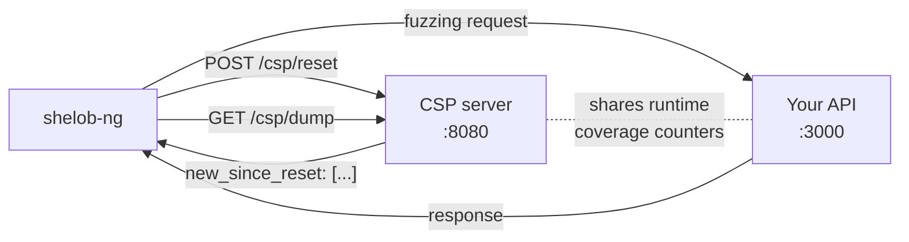
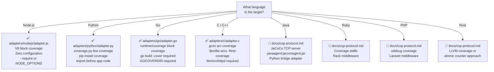

# CSP Servers — Setup and Reference

This document is a complete operational guide to the **four CSP adapter servers**
shipped with shelob-ng in the `adapters/` directory, plus a formal specification
of the Coverage Sidecar Protocol they implement.

**Quick start:** pick the adapter matching your target's language, follow the
three-step setup, then pass `-csp-url http://localhost:8080` to shelob-ng.

---

## What a CSP Server Is

A **CSP server** (Coverage Sidecar Process) is an HTTP server that sits alongside
your target application and exposes its runtime code coverage via two endpoints.
shelob-ng calls these endpoints on every fuzzing iteration to measure which code
paths were newly exercised by each input.



The dashed line is the key constraint: **the CSP server must share the same
runtime coverage counters as the target application.** This is achieved by:

- **In-process** (Node.js, Python, Go, C): the adapter runs inside the same
  OS process as the target, sharing memory directly.
- **Out-of-process via IPC** (Java/JaCoCo): the adapter connects to the JVM's
  TCP server to issue reset/dump commands.
- **Shared file system** (C/gcov external): the adapter and target write to the
  same `.gcda` files.

---

## Coverage Sidecar Protocol — Formal Specification

### Version

Protocol version: **1.0** (no versioning headers required; all existing adapters
implement this version).

### Base URL

Configurable. Default: `http://localhost:8080`. Set via `-csp-url` flag:

```
./shelob-ng -spec api.json -url http://localhost:3000 -csp-url http://localhost:8080
```

### Endpoint 1 — POST /csp/reset

**Purpose:** Snapshot the current coverage state as a baseline. Called by
shelob-ng immediately before sending each fuzzing request to the target.

**Request:**
```
POST /csp/reset HTTP/1.1
Host: localhost:8080
Content-Length: 0
```
Request body is ignored (may be absent).

**Success response:**
```
HTTP/1.1 200 OK
Content-Length: 3

OK
```
Response body is ignored by shelob-ng.

**Semantics:** after this call, all subsequent code execution in the target
process represents new coverage relative to this baseline.

### Endpoint 2 — GET /csp/dump

**Purpose:** Return the coverage delta since the last reset. Called by
shelob-ng immediately after the target returns its response.

**Request:**
```
GET /csp/dump HTTP/1.1
Host: localhost:8080
```

**Success response:**
```json
HTTP/1.1 200 OK
Content-Type: application/json

{
    "new_since_reset": ["src/routes/users.js:142", "src/db/query.js:87"],
    "covered_lines":   3847,
    "total_lines":     12400
}
```

**Response fields:**

| Field | Type | Required | Used by shelob-ng | Description |
|-------|------|----------|-------------------|-------------|
| `new_since_reset` | `string[]` | **YES** | `len()` → delta | Code units covered since last reset |
| `covered_lines` | integer | no | display only | Cumulative coverage across all requests |
| `total_lines` | integer | no | display only | Total instrumented code units |
| `bitmap` | string | no | ignored | Reserved for future use |

**The delta signal:** shelob-ng computes `delta = len(new_since_reset)`. When
`delta > 0`, the triggering corpus entry is admitted with `weight = delta`.
The string values in `new_since_reset` are never parsed — any unique identifier
format is acceptable.

**Error responses:** any non-200 status causes shelob-ng to treat `delta = 0`
(the request is not admitted to the corpus). The fuzzing loop continues.

### Endpoint 3 — GET /csp/v8report (Node.js only)

**Purpose:** Return accumulated V8 ScriptCoverage data for use with the `c8`
HTML coverage report tool. Not used by shelob-ng's fuzzing loop.

### Endpoint 4 — POST /csp/v8clear (Node.js only)

**Purpose:** Reset the accumulated coverage data and baseline. Useful for
clearing state between test sessions without restarting the server.

### Connection behaviour

shelob-ng uses a persistent HTTP client with connection reuse (HTTP/1.1
keep-alive). The CSP server should support keep-alive connections to minimize
per-request overhead. All four shipped adapters support keep-alive by default.

---

## Adapter 1: Node.js (`adapters/nodejs/adapter.js`)

**Target applications:** Express, Fastify, NestJS, Koa, Hapi, or any Node.js
HTTP server.

**Coverage mechanism:** V8 Inspector `Profiler.startPreciseCoverage` — block-level
coverage built into the V8 JavaScript engine.

**Endpoints:** `/csp/reset`, `/csp/dump`, `/csp/v8report`, `/csp/v8clear`

### How it works

The adapter opens an `inspector.Session` in the same process as the target,
enabling V8's precise coverage mode. Every call to `Profiler.takePreciseCoverage`
returns an array of `ScriptCoverage` objects — one per loaded script — each
containing `FunctionCoverage` entries with `CoverageRange` blocks. A block with
`count > 0` was executed.

On reset: the adapter snapshots the current set of covered block offsets.
On dump: it takes a new snapshot, returns the difference (new blocks), and
merges the full snapshot into the accumulated map for HTML reports.

V8 coverage operates at the **basic block** level — each `if`/`else`/`try`/
`catch` branch is a separate block. This gives higher resolution than
line-level coverage and catches branch divergence within a single line.

### Installation

```bash
# No installation required — uses Node.js built-in inspector module
node --version  # requires Node.js 12+
```

### Configuration

| Environment variable | Default | Description |
|----------------------|---------|-------------|
| `CSP_PORT` | `8080` | Port the CSP HTTP server listens on |

### Integration patterns

**Pattern 1 — NODE_OPTIONS (no source code changes, recommended)**

```bash
# For any Node.js application: prepend adapter.js via NODE_OPTIONS
export NODE_OPTIONS="--require /path/to/shelob-ng/adapters/nodejs/adapter.js"

# Now start your application normally
node server.js
# or
npm start
# or
npx ts-node src/main.ts
```

`--require` loads adapter.js before any application code, ensuring coverage
is active from the first line of your server.

**Pattern 2 — Direct invocation**

```bash
node -e "require('./adapters/nodejs/adapter.js'); require('./server.js')"
```

**Pattern 3 — Import in entrypoint**

```javascript
// server.js — add as first line
require('/path/to/shelob-ng/adapters/nodejs/adapter.js');

// rest of your code
const express = require('express');
// ...
```

**Pattern 4 — package.json script**

```json
{
  "scripts": {
    "start:fuzz": "NODE_OPTIONS='--require ./node_modules/shelob-csp/adapter.js' node server.js"
  }
}
```

### OWASP Juice Shop setup (full example)

```bash
# 1. Clone Juice Shop
git clone https://github.com/juice-shop/juice-shop.git
cd juice-shop
npm install

# 2. Start with CSP adapter
CSP_PORT=8080 NODE_OPTIONS="--require /path/to/shelob-ng/adapters/nodejs/adapter.js" \
  npm start &

# Wait for startup
until curl -s http://localhost:3000/rest/admin/application-version > /dev/null; do
  sleep 2; done
echo "Juice Shop ready"

# 3. Verify CSP sidecar
curl -s -X POST http://localhost:8080/csp/reset
# → OK

curl -s http://localhost:3000/rest/products/search?q=apple > /dev/null
curl -s http://localhost:8080/csp/dump | python3 -c "
import json, sys
d = json.load(sys.stdin)
print(f'delta: {len(d[\"new_since_reset\"])} new V8 blocks')
print(f'covered: {d[\"covered_lines\"]} / {d[\"total_lines\"]} lines')
"
# Expected output:
# delta: 47 new V8 blocks
# covered: 3201 / 12847 lines

# 4. Run shelob-ng in coverage-guided mode
./shelob-ng \
  -spec   juice-shop.openapi.json \
  -url    http://localhost:3000 \
  -csp-url http://localhost:8080 \
  -user   admin@juice-sh.op \
  -password admin123 \
  -duration 1h \
  -output results/csp-run
```

### Docker with Juice Shop

The `example/juice-shop/` directory contains a ready-to-use Docker setup:

```bash
cd example/juice-shop/

# Build CSP-instrumented image
docker compose -f docker-compose.yml -f docker-compose.csp.yml build

# Start (Juice Shop on :3000, CSP on :8080)
docker compose -f docker-compose.yml -f docker-compose.csp.yml up -d

# Verify
curl -s -X POST http://localhost:8080/csp/reset && echo "CSP reset: OK"
curl -s http://localhost:8080/csp/dump | python3 -c "
import json,sys; d=json.load(sys.stdin); print('CSP dump: OK, lines=', d.get('total_lines', 0))"

# Run fuzzer
make run-5  # scenario 5 = coverage-guided
```

The `docker-compose.csp.yml` adds these to the Juice Shop container:

```yaml
services:
  juice-shop-csp:
    build:
      context: csp/
      dockerfile: Dockerfile
    environment:
      - CSP_PORT=8080
    ports:
      - "3000:3000"
      - "8080:8080"
```

And `csp/Dockerfile`:

```dockerfile
FROM bkimminich/juice-shop:latest
COPY adapter.js /juice-shop/csp-adapter.js
ENV NODE_OPTIONS="--require /juice-shop/csp-adapter.js"
EXPOSE 3000 8080
```

### Generating an HTML coverage report

After a fuzzing run, use `c8` to visualise which code was exercised:

```bash
# 1. Collect accumulated V8 coverage
mkdir -p /tmp/v8cov
curl -s http://localhost:8080/csp/v8report > /tmp/v8cov/coverage-0.json

# 2. Generate HTML report
npx c8 report --temp-dir /tmp/v8cov --reporter html --all
open coverage/index.html
```

### Troubleshooting

| Symptom | Cause | Fix |
|---------|-------|-----|
| `delta: 0` after all requests | Adapter not loaded in same process | Confirm `NODE_OPTIONS=--require adapter.js` before app starts |
| `delta` same value every request | Baseline not being reset | Check `/csp/reset` returns 200; check adapter loaded before requests start |
| Sidecar port conflict | Another process on :8080 | Set `CSP_PORT=8081` (or any free port) |
| `inspector` module not found | Node.js < 12 | Update to Node.js 16+ |
| Script URLs show `<anonymous>` | Scripts loaded via `eval()` | Not a problem — anonymous blocks still contribute to delta |
| Very slow `/csp/dump` | Too many loaded scripts | Add more entries to `SKIP_URL` filter to exclude large libraries |

---

## Adapter 2: Go (`adapters/go/adapter.go`)

**Target applications:** Any Go HTTP service — net/http, Gin, Echo, Fiber, Chi.

**Coverage mechanism:** `runtime/coverage.ClearCounters()` + `coverage.WriteCountersDir()`
(Go 1.20+, full support Go 1.21+).

**Endpoints:** `/csp/reset`, `/csp/dump`

### How it works

Go's `-cover` build flag instruments every function with counter arrays stored
in the binary's `.data` section. Each element corresponds to a basic block.
`ClearCounters()` zeros all arrays atomically. `WriteCountersDir()` writes
the current counter state to binary `.covcounters.*` files in a directory.

The adapter reads these files after every dump: any counter value `> 0` means
that block executed since the last reset. The file byte offset is used as a
stable block identifier (e.g., `"abc123.covcounters:48"`).

**Important:** `GOCOVERDIR` must be set to a writable directory for
`WriteCountersDir()` to work. On Linux, `/dev/shm` (tmpfs) is recommended
to avoid disk I/O.

### Installation

```bash
# No external dependencies — uses only Go standard library
# Requires Go 1.20+ for full functionality
go version
```

### Configuration

| Setting | How to set | Default | Description |
|---------|-----------|---------|-------------|
| Port | `ListenAndServe(addr)` parameter | `:8080` | CSP server address |
| `GOCOVERDIR` | environment variable | **required** | Directory for coverage counter files |

### Integration: Import in your application

```go
// main.go
package main

import (
    "log"
    "os"

    csp "github.com/yourusername/yourapp/adapters/go"
    // or copy adapter.go into your project:
    // csp "yourapp/internal/csp"
)

func main() {
    // Start CSP sidecar before the main HTTP server
    go func() {
        addr := os.Getenv("CSP_ADDR")
        if addr == "" { addr = ":8080" }
        if err := csp.ListenAndServe(addr); err != nil {
            log.Fatalf("CSP server: %v", err)
        }
    }()

    // Your application server
    startMyApp(":3000")
}
```

### Build and run

```bash
# Step 1: create the GOCOVERDIR directory
# Use /dev/shm (tmpfs) for best performance on Linux
mkdir -p /dev/shm/gocov
export GOCOVERDIR=/dev/shm/gocov

# Step 2: build with coverage instrumentation
go build -cover -o myapp ./cmd/myapp

# Step 3: run
./myapp &

# Step 4: verify CSP sidecar
curl -s -X POST http://localhost:8080/csp/reset
# → OK

curl -s http://localhost:3000/api/users > /dev/null
curl -s http://localhost:8080/csp/dump | python3 -c "
import json, sys
d = json.load(sys.stdin)
print(f'delta: {len(d[\"new_since_reset\"])} covered blocks')
"
```

### Gin framework example

```go
// main.go
package main

import (
    "net/http"
    "os"
    "github.com/gin-gonic/gin"
    csp "yourapp/internal/csp"
)

func main() {
    // CSP sidecar on a separate goroutine
    go csp.ListenAndServe(":8080")

    r := gin.Default()
    r.GET("/api/users",     getUsers)
    r.GET("/api/users/:id", getUser)
    r.POST("/api/users",    createUser)
    r.Run(":3000")
}
```

```bash
GOCOVERDIR=/dev/shm/gocov go run -cover . &
./shelob-ng -spec api.json -url http://localhost:3000 -csp-url http://localhost:8080
```

### Echo framework example

```go
import (
    "github.com/labstack/echo/v4"
    csp "yourapp/internal/csp"
)

func main() {
    go csp.ListenAndServe(":8080")

    e := echo.New()
    e.GET("/api/users", handlers.GetUsers)
    e.Start(":3000")
}
```

### Docker with Go service

```dockerfile
# Dockerfile.fuzz
FROM golang:1.22 AS builder
WORKDIR /app
COPY . .
# Build with coverage instrumentation
RUN go build -cover -o server ./cmd/server

FROM debian:bookworm-slim
WORKDIR /app
COPY --from=builder /app/server .

# tmpfs for coverage files (no disk I/O)
RUN mkdir -p /dev/shm/gocov
ENV GOCOVERDIR=/dev/shm/gocov

EXPOSE 3000 8080
CMD ["./server"]
```

```yaml
# docker-compose.fuzz.yml
services:
  myapi:
    build:
      dockerfile: Dockerfile.fuzz
    ports:
      - "3000:3000"   # API
      - "8080:8080"   # CSP sidecar
    environment:
      - GOCOVERDIR=/dev/shm/gocov
    tmpfs:
      - /dev/shm:size=256m   # ensure tmpfs is available
```

### Go version compatibility

| Go version | `ClearCounters()` | `WriteCountersDir()` | Notes |
|------------|-------------------|----------------------|-------|
| < 1.20 | ❌ not available | ❌ not available | Use third-party coverage (e.g. `goc`) |
| 1.20 | ✅ available | ✅ available | Minimal implementation |
| 1.21+ | ✅ improved | ✅ improved | Recommended — more accurate counter parsing |
| 1.22+ | ✅ | ✅ | Current; best compatibility |

### Troubleshooting

| Symptom | Cause | Fix |
|---------|-------|-----|
| `WriteCountersDir: not in coverage test mode` | Built without `-cover` | Rebuild: `go build -cover -o server .` |
| `WriteCountersDir: GOCOVERDIR not set` | `GOCOVERDIR` env var missing | `export GOCOVERDIR=/dev/shm/gocov && mkdir -p $GOCOVERDIR` |
| `delta: 0` always | `ClearCounters()` is a no-op (Go 1.20 bug) | Upgrade to Go 1.21+ |
| Slow `/csp/dump` (> 50 ms) | `GOCOVERDIR` on disk | Move to `/dev/shm` (tmpfs) |
| Empty `new_since_reset` after first request | Counter files smaller than header | Check that `-cover` was passed to `go build`, not just `go test` |

---

## Adapter 3: Python (`adapters/python/adapter.py`)

**Target applications:** Flask, Django, FastAPI, any Python WSGI/ASGI application.

**Coverage mechanism:** `coverage.py` — the standard Python test coverage library,
using `sys.settrace()` to record executed lines.

**Endpoints:** `/csp/reset`, `/csp/dump`

### How it works

`coverage.Coverage().start()` installs a trace function via `sys.settrace()`
that records every executed line. `COV.get_data()` returns the accumulated
line-level data as a `CoverageData` object. The adapter reads `.measured_files()`
and `.lines(filename)` to build a set of `"filename:lineno"` strings.

On reset: snapshot the current set. On dump: compute the symmetric difference.

**Note:** the adapter must be imported before your application starts its modules,
because `coverage.py` only instruments code that is imported after `COV.start()`.

### Installation

```bash
pip install coverage>=7.0
```

### Configuration

| CLI argument | Default | Description |
|--------------|---------|-------------|
| `--host` | `0.0.0.0` | Bind address for CSP server |
| `--port` | `8080` | Port for CSP server |

The adapter can also be used as a library (no CLI arguments needed when embedded).

### Integration patterns

**Pattern 1 — Standalone (wraps your application)**

```bash
python adapters/python/adapter.py --port 8080 &

# Start your app separately (adapter is already tracking coverage via COV.start())
# NOTE: this only works if your app and the adapter share the same Python process!
# For separate processes, use Pattern 3 (sitecustomize.py)
```

**Pattern 2 — Import before application (recommended)**

```python
# run_fuzz.py — entrypoint for fuzzing sessions
import sys
sys.path.insert(0, '/path/to/shelob-ng/adapters/python')
import adapter   # starts coverage + launches CSP server thread

# Now import and run your application
from myapp import create_app
app = create_app()
app.run(port=3000)
```

```bash
python run_fuzz.py
```

**Pattern 3 — sitecustomize.py (universal, no source changes)**

`sitecustomize.py` is executed by the Python interpreter at startup, before any
other code. Place it in the working directory or on `PYTHONPATH`:

```python
# sitecustomize.py
import sys
import os

if os.environ.get('CSP_ENABLED', '0') == '1':
    sys.path.insert(0, os.environ.get('CSP_ADAPTER_PATH', '.'))
    import adapter
    print('[CSP] adapter loaded via sitecustomize', file=sys.stderr)
```

```bash
CSP_ENABLED=1 CSP_ADAPTER_PATH=/path/to/adapters/python \
  PYTHONPATH=. \
  gunicorn myapp:app --bind 0.0.0.0:3000 --workers 1
```

**Pattern 4 — Direct import in Flask app**

```python
# app.py
# This must be the VERY FIRST import in the file
import sys
sys.path.insert(0, '/path/to/shelob-ng/adapters/python')
import adapter  # starts Coverage + CSP server on port 8080

from flask import Flask
app = Flask(__name__)

@app.route('/api/users')
def get_users():
    return {'users': []}

if __name__ == '__main__':
    app.run(port=3000)
```

```bash
python app.py
```

**Pattern 5 — Django via AppConfig.ready()**

```python
# myapp/apps.py
from django.apps import AppConfig

class MyAppConfig(AppConfig):
    default_auto_field = 'django.db.models.BigAutoField'
    name = 'myapp'

    def ready(self):
        """Called once when Django finishes loading."""
        import sys
        sys.path.insert(0, '/path/to/shelob-ng/adapters/python')
        from adapter import start_csp_server
        import threading
        threading.Thread(
            target=start_csp_server,
            kwargs={'addr': '0.0.0.0', 'port': 8080},
            daemon=True
        ).start()
```

```python
# myapp/__init__.py
default_app_config = 'myapp.apps.MyAppConfig'
```

```bash
python manage.py runserver 3000
```

**Pattern 6 — FastAPI with lifespan**

```python
# main.py
import sys
sys.path.insert(0, '/path/to/shelob-ng/adapters/python')

from contextlib import asynccontextmanager
from fastapi import FastAPI
from adapter import start_csp_server
import threading

@asynccontextmanager
async def lifespan(app: FastAPI):
    # Start CSP on application startup
    threading.Thread(
        target=start_csp_server,
        kwargs={'addr': '0.0.0.0', 'port': 8080},
        daemon=True
    ).start()
    yield
    # Shutdown cleanup (if any) here

app = FastAPI(lifespan=lifespan)

@app.get('/api/users')
def get_users():
    return []
```

```bash
uvicorn main:app --port 3000
```

### VAmPI setup (full example)

[VAmPI](https://github.com/erev0s/VAmPI) is a vulnerable Python/Flask API —
ideal for testing the Python adapter.

```bash
# 1. Clone VAmPI
git clone https://github.com/erev0s/VAmPI.git
cd VAmPI
pip install -r requirements.txt
pip install coverage

# 2. Create the entrypoint that loads CSP before VAmPI
cat > run_fuzz.py << 'EOF'
import sys
sys.path.insert(0, '/path/to/shelob-ng/adapters/python')
import adapter                    # starts coverage.py + CSP server on :8080
from app import app                # import VAmPI's Flask app AFTER coverage is active
app.run(host='0.0.0.0', port=5000, debug=False)
EOF

# 3. Start VAmPI with CSP
python run_fuzz.py &

# 4. Seed the database
curl -s http://localhost:5000/createdb

# 5. Verify CSP
curl -s -X POST http://localhost:8080/csp/reset
curl -s http://localhost:5000/users/v1/admin1 > /dev/null
curl -s http://localhost:8080/csp/dump | python3 -c "
import json, sys
d = json.load(sys.stdin)
print(f'delta: {len(d[\"new_since_reset\"])} lines')
print(f'sample:', d['new_since_reset'][:3])
"
# Expected:
# delta: 23 lines
# sample: ['/app/VAmPI/models/users_model.py:42', ...]

# 6. Run shelob-ng
./shelob-ng \
  -spec    http://localhost:5000/openapi.json \
  -url     http://localhost:5000 \
  -csp-url http://localhost:8080 \
  -user    admin1 -password pass1 \
  -duration 30m \
  -output  results/vampi-csp
```

### gunicorn note

gunicorn uses multiple worker processes. The CSP adapter tracks coverage only
within the process it was started in. For reliable coverage, use a single worker:

```bash
gunicorn --workers 1 --bind 0.0.0.0:3000 myapp:app
```

For multi-worker deployments, the adapter must be loaded in the `post_fork`
hook (see `csp-protocol.md`).

### Troubleshooting

| Symptom | Cause | Fix |
|---------|-------|-----|
| `WARNING: 'coverage' not installed` | `coverage` package missing | `pip install coverage>=7.0` |
| `delta: 0` on all requests | Adapter imported after app code | Move `import adapter` to the **first line** of your entrypoint |
| `delta` grows but never resets | Same as above — baseline snapshot captures nothing | Same fix as above |
| Port already in use | Another process on :8080 | Run with `--port 8081` (or any free port) |
| Coverage misses some files | Framework loads files before adapter | Use sitecustomize.py pattern to load before interpreter |
| gunicorn/uWSGI: delta=0 | Multiple worker processes | Use `--workers 1` or load adapter in `post_fork` |

---

## Adapter 4: C / C++ (`adapters/c/adapter.c`)

**Target applications:** Any C or C++ application compiled with GCC or Clang
with gcov instrumentation.

**Coverage mechanism:** GCC/Clang built-in `__gcov_dump()` / `__gcov_reset()` —
low-level arc-based coverage tracking.

**Endpoints:** `/csp/reset`, `/csp/dump`

### How it works

Compiling with `-fprofile-arcs -ftest-coverage` inserts a counter increment
at every arc (control flow edge: if/else/switch/while/for transitions). The
counters are stored in memory and flushed to `.gcda` files when `__gcov_dump()`
is called. `__gcov_reset()` zeroes all in-memory counters.

The adapter calls these functions on reset/dump and approximates the delta
by tracking the cumulative count. A full implementation would parse `.gcda`
files to enumerate individual arc identifiers.

### Dependencies

```bash
# Ubuntu/Debian
apt install libmicrohttpd-dev

# macOS (Homebrew)
brew install libmicrohttpd

# Fedora/RHEL
dnf install libmicrohttpd-devel
```

### Build modes

**Mode 1 — Embedded library (recommended)**

Link the adapter into your application binary:

```c
/* myapp.c */
#include "adapter.h"  // declares: int csp_start(uint16_t port);

int main(void) {
    csp_start(8080);   // non-blocking: starts background thread
    run_http_server(3000);
    return 0;
}
```

```bash
# Create adapter.h (minimal declaration):
echo 'int csp_start(unsigned short port);' > adapter.h

# Compile everything together with gcov instrumentation:
gcc -fprofile-arcs -ftest-coverage \
    -o myapp \
    myapp.c adapters/c/adapter.c \
    -lmicrohttpd

# Run
mkdir -p /tmp/gcov && GCOV_PREFIX=/tmp/gcov ./myapp
```

**Mode 2 — Standalone sidecar (separate process)**

When you cannot modify the target binary:

```bash
# Build adapter as standalone executable
gcc -DCSP_STANDALONE \
    -o csp_adapter \
    adapters/c/adapter.c \
    -lmicrohttpd

# The target must be compiled with -fprofile-arcs -ftest-coverage
gcc -fprofile-arcs -ftest-coverage -o mytarget mytarget.c

# Run both from the same working directory (so .gcda files are shared)
./mytarget &
./csp_adapter 8080 &
```

In standalone mode, the sidecar and target must share the same `.gcda` file
path — both processes write to the current working directory by default.
Use `GCOV_PREFIX` to control the location.

### Full example: civetweb

```bash
# 1. Clone and build civetweb with gcov + CSP embedded
git clone https://github.com/civetweb/civetweb.git
cd civetweb

# Patch CMakeLists.txt to add gcov flags:
# add_compile_options(-fprofile-arcs -ftest-coverage)
# target_link_libraries(civetweb gcov)

mkdir build && cd build
cmake .. -DCIVETWEB_ENABLE_CXX=ON
make -j4

# 2. Build the CSP adapter as a shared lib or include in build
# (implementation left to integrator — link adapter.c with your build system)

# 3. Run civetweb on port 3000, CSP on port 8080
./civetweb -listening_ports 3000 &
./csp_adapter 8080 &

# 4. Verify
curl -s -X POST http://localhost:8080/csp/reset
curl -s http://localhost:3000/
curl -s http://localhost:8080/csp/dump
```

### Clang LLVM coverage (alternative to gcov)

Clang's `--coverage` flag (equivalent to `-fprofile-arcs -ftest-coverage`) uses
the same `__gcov_dump()` / `__gcov_reset()` symbols, so the adapter works
without modification.

For LLVM's newer source-based coverage (`-fprofile-instr-generate -fcoverage-mapping`),
the adapter would need to call `__llvm_profile_write_file()` and
`__llvm_profile_reset_counters()` instead — these are different symbols.

### Troubleshooting

| Symptom | Cause | Fix |
|---------|-------|-----|
| `failed to start daemon on port 8080` | Port occupied or libmicrohttpd not found | Check `ldd ./csp_adapter | grep micro`; kill conflicting process |
| `delta: 0` always | Target not compiled with `-fprofile-arcs` | Recompile: `gcc -fprofile-arcs -ftest-coverage -o target target.c` |
| `.gcda` files not created | `GCOV_PREFIX` points to non-writable dir | `mkdir -p /tmp/gcov && export GCOV_PREFIX=/tmp/gcov` |
| Segfault in `__gcov_reset()` | Mixed gcov versions | Compile target and adapter with same GCC version |
| `new_since_reset` is a number, not an array | Reference implementation limitation | This is a known stub; the adapter returns a synthetic count, not per-arc IDs. See `csp-protocol.md` for a full `.gcda` parser. |

---

## Choosing the Right Adapter



---

## Universal Verification Procedure

Run these checks after setting up any CSP adapter to confirm it works correctly
before starting a fuzzing session.

```bash
CSP_URL="http://localhost:8080"
TARGET_URL="http://localhost:3000"
SOME_ENDPOINT="/api/users"   # replace with a real endpoint

echo "=== CSP Verification ==="

# Step 1: CSP server responds
echo -n "1. CSP server reachable: "
HTTP=$(curl -s -o /dev/null -w "%{http_code}" -X POST "$CSP_URL/csp/reset")
[ "$HTTP" = "200" ] && echo "OK (HTTP $HTTP)" || echo "FAIL (HTTP $HTTP)"

# Step 2: Delta is 0 with no requests (baseline snapshotted correctly)
echo -n "2. Delta after reset (no requests): "
DELTA=$(curl -s "$CSP_URL/csp/dump" | python3 -c "import json,sys; print(len(json.load(sys.stdin)['new_since_reset']))")
[ "$DELTA" = "0" ] && echo "OK (delta=0)" || echo "WARN (delta=$DELTA, should be 0)"

# Step 3: Delta > 0 after a real request
curl -s -X POST "$CSP_URL/csp/reset" > /dev/null
curl -s "$TARGET_URL$SOME_ENDPOINT" > /dev/null
echo -n "3. Delta after one request: "
DELTA=$(curl -s "$CSP_URL/csp/dump" | python3 -c "import json,sys; print(len(json.load(sys.stdin)['new_since_reset']))")
[ "$DELTA" -gt "0" ] 2>/dev/null && echo "OK (delta=$DELTA)" || echo "FAIL (delta=$DELTA, should be > 0)"

# Step 4: Consecutive identical requests produce delta=0 (coverage saturated)
curl -s -X POST "$CSP_URL/csp/reset" > /dev/null
curl -s "$TARGET_URL$SOME_ENDPOINT" > /dev/null
curl -s -X POST "$CSP_URL/csp/reset" > /dev/null   # reset again
curl -s "$TARGET_URL$SOME_ENDPOINT" > /dev/null   # same request
echo -n "4. Delta for repeated identical request: "
DELTA=$(curl -s "$CSP_URL/csp/dump" | python3 -c "import json,sys; print(len(json.load(sys.stdin)['new_since_reset']))")
# This SHOULD be 0 (same code path) but may be > 0 for JIT-compiled languages
echo "delta=$DELTA (expected 0 or low)"

echo ""
echo "=== Verification complete ==="
echo "If steps 1-3 passed, CSP is working correctly."
echo "Run: ./shelob-ng -spec api.json -url $TARGET_URL -csp-url $CSP_URL"
```

---

## Performance Reference

Measured on an average developer machine (Intel i7, SSD, localhost):

| Adapter | Reset latency | Dump latency | Overhead vs pure-random |
|---------|--------------|-------------|------------------------|
| Node.js (V8) | 2–5 ms | 5–15 ms | +15–30% per iteration |
| Python (coverage.py) | 1–3 ms | 3–10 ms | +10–20% per iteration |
| Go (runtime/coverage + tmpfs) | < 1 ms | 2–8 ms | +5–15% per iteration |
| Go (runtime/coverage + disk) | < 1 ms | 20–80 ms | +50–200% per iteration |
| C (gcov + tmpfs) | < 1 ms | 5–20 ms | +10–30% per iteration |

At a typical 30 req/s fuzzing rate, CSP overhead is 60 additional HTTP requests
per second to the sidecar — well within what a local HTTP server can handle.
